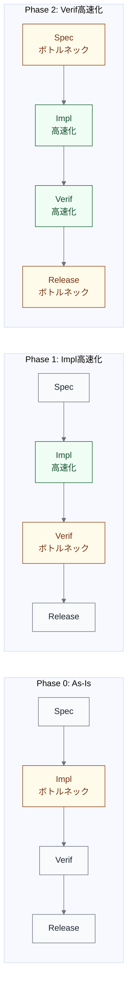

import { Aside } from '@astrojs/starlight/components';

## ボトルネックは移動する

[制約理論](/dynamics/theoretical-foundations/#制約理論theory-of-constraints-toc)の核心は、制約を緩和すると次の制約が現れることである。AI導入でよく発生するボトルネック移動を4つのパターンに整理する。

## 全体像

**色の意味**: 黄 = ボトルネック、緑 = 高速化済み、グレー = 変化なし

## パターン1: Implementation → Verification 移動

最も頻繁に発生するパターン。

### メカニズム

| 状態 | 説明 |
|---|---|
| **AI導入前** | Implementation がボトルネック。λ(Impl) < λ(Verif) のため、Implementation の前にキューが溜まる |
| **AI導入後** | Implementation を高速化。λ(Impl) >> λ(Verif) となり、Verification の前にキューが溜まる |
| **結果** | ボトルネックが Verification に移動。レビュー待ち時間が増大する |

### 典型的な症状

- PR作成からレビュー開始までの待ち時間が急増
- レビュアーあたりのPR負荷が増加（レビュー疲れ）
- レビュー品質の低下（並列度が高すぎると品質が落ちる）

### 対処の方向性

| アプローチ | 対処 | TOC的位置づけ |
|---|---|---|
| **Supply制御** | PR並列度制限（同時N件以下） | 従属（ステップ3） |
| **Demand拡張** | AI一次レビューの導入 | 緩和（ステップ4） |
| **Bypass** | 低リスクPRの自動マージ | 緩和（ステップ4） |

<Aside type="caution">
Demand拡張（AIレビュー）を導入する際は、[Executor と Evaluator の分離原則](/execution/ai-four-facets/#evaluator評価者)に注意する。コードを書いたAIと同じインスタンスがレビューすると、自己評価バイアスが生じる。
</Aside>

## パターン2: Verification → Release 移動

パターン1の対処後に発生しやすい。

### メカニズム

| 状態 | 説明 |
|---|---|
| **対処後** | Verification も高速化。λ(Verif) >> λ(Release) となり、Release の前にキューが溜まる |
| **ボトルネック** | リリース判断、統合テスト、デプロイ手順が律速する |

### 典型的な症状

- 承認済みPRが溜まっているのにリリースされない
- リリース頻度が週次・月次のバッチに制約される
- 統合テストの実行時間がデプロイ頻度を律速する

### 対処の方向性

| アプローチ | 対処 |
|---|---|
| バッチサイズの縮小 | リリースを小さく頻繁にする |
| 自動リリース判断 | 条件を満たしたPRの自動デプロイ |
| パイプラインの高速化 | 統合テスト・デプロイ手順の並列化 |

## パターン3: Specification → Implementation 移動

Implementation と Verification の両方を高速化した後に現れる。

### メカニズム

| 状態 | 説明 |
|---|---|
| **AI導入前** | Implementation が遅いため、Specification の出力を十分消化していた |
| **AI導入後** | Implementation が高速化。λ(Impl) >> λ(Spec) となり、「何を作るか」の定義が追いつかない |
| **結果** | 「作るべきものの定義」がボトルネックになる |

### 典型的な症状

- AIエージェントが待機状態になる（作るべきものがない）
- 仕様が曖昧なまま実装が始まり、差し戻しが増える
- Framing や Discovery の充実が急務になる

### 対処の方向性

| アプローチ | 対処 |
|---|---|
| 上流の強化 | Specification / Design への投資 |
| AIの活用範囲拡大 | AI を仕様検討の壁打ち相手（Consulted）として活用 |
| バッファの設計 | 十分にspecifiedなタスクのバックログを維持 |

<Aside>
AIは「作り方」を高速化するが、「何を作るか」の判断は高速化しにくい。これは[裁量レベル](/execution/raci-and-discretion/)の設計において、上流ステップほどL0〜L1に留まりやすい理由の一つでもある。
</Aside>

## パターン4: 差し戻しループの増幅

パターン1〜3とは異なり、特定のステップへの移動ではなく、**ループ自体の増幅**として現れる。

### メカニズム

| 状態 | 説明 |
|---|---|
| **AI導入後** | Implementation が高速化されるが、品質が不安定 |
| **差し戻し率上昇** | R_rework が上昇し、差し戻しの再処理がWIPを増やす |
| **結果** | 見かけのスループットは高いが、実効スループットは低い |

### 典型的な症状

- PR数は多いが、マージまでの平均サイクル数が増える
- 同じPRが何度も差し戻される（ピンポンレビュー）
- AIが速く書いたコードが差し戻され、高速回転する差し戻しループが全体の流量を圧迫する

### 対処の方向性

| アプローチ | 対処 |
|---|---|
| 品質の事前確保 | AI実行前の制御環境（リンター、型チェック、テスト）を強化 |
| 差し戻し優先 | 新規タスクより差し戻し修正を優先するポリシー |
| 実効スループットの計測 | マージ済みPR数で測定し、作成PR数と区別する |

## 4パターンの比較

| パターン | 移動先 | 発生条件 | 対処の核 |
|---|---|---|---|
| 1 | Implementation → Verification | Impl の高速化 | Supply制御 + Demand拡張 |
| 2 | Verification → Release | Verif の高速化 | バッチサイズ縮小 + 自動化 |
| 3 | Specification → Implementation | Impl + Verif の高速化 | 上流への投資 |
| 4 | 差し戻しループの増幅 | 品質不安定なまま高速化 | 品質の事前確保 + 差し戻し優先 |

## フロー分析の適用手順

ボトルネック移動に対処するために、[TOC の5ステップ](/dynamics/theoretical-foundations/#toc-の5ステップ)を以下のように適用する。

1. **特定** — [フロー変数](/dynamics/flow-variables/)を観測し、キュー長・待ち時間からボトルネックを見つける
2. **活用** — ボトルネックの稼働率を最大化する（レビュアーの負荷分散、優先度付け等）
3. **従属** — ボトルネック以外をボトルネックのペースに合わせる（[WIP制限](/dynamics/wip-limits/)）
4. **緩和** — ボトルネックの能力を拡大する（AIレビュー、自動マージ等）
5. **繰り返し** — ボトルネックが移動したら1に戻る
