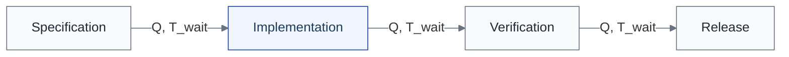

import { Aside } from '@astrojs/starlight/components';

## フロー変数の定義

ライフサイクルのフローを記述するために、以下の7つの変数を定義する。

| 変数 | 記号 | 定義 | 単位例 | 観測点 |
|---|---|---|---|---|
| **スループット** | λ | 単位時間あたりの処理完了数 | PR/日、タスク/週 | 各L1の出口 |
| **タッチタイム** | T_touch | 実作業時間 | 時間/PR | 各L2 |
| **待ち時間** | T_wait | キューで待つ時間 | 時間/PR | L1間の境界 |
| **リードタイム** | T_lead | 着手から完了までの総時間 | 時間/PR | L1の入口→出口 |
| **WIP** | WIP | ある時点で進行中のアイテム数 | PR数、タスク数 | 各L1 |
| **キュー長** | Q | 処理待ちのアイテム数 | PR数 | L1間の境界 |
| **差し戻し率** | R_rework | 差し戻されたアイテムの比率 | % | Verification → Implementation |

## リトルの法則

フロー変数の間には、以下の基本的な関係が成り立つ。

> **T_lead = WIP / λ**

リードタイムを短縮するには、**WIP を減らすか、スループットを上げる**しかない。

### AI導入での含意

AI は局所的にスループット（λ）を上げるが、WIP も同時に増やしがちである。

| 項目 | AI導入前 | AI導入後 |
|---|---|---|
| λ(Implementation) | 2 PR/日 | 8 PR/日 |
| WIP(全体) | 6 PR | 20 PR |
| T_lead(全体) | 3日 | 2.5日 |

この例では、スループットは4倍になったが、WIPも3倍以上に膨らんだため、リードタイムはわずか17%の改善にとどまっている。

<Aside type="caution">
PRの大量生成はスループットの向上に見えるが、WIP の増加がリードタイムの改善を相殺する。リトルの法則は、[WIP制限](/dynamics/wip-limits/)がなぜ有効かを数学的に説明する。
</Aside>

## 観測点とライフサイクルの対応

各フロー変数は、ライフサイクルの特定の場所で観測する。

| 観測場所 | 観測するフロー変数 | 具体的な測り方 |
|---|---|---|
| 各L1の内部 | λ、T_touch、WIP | 処理完了数/日、実作業時間、進行中アイテム数 |
| L1間の境界 | Q、T_wait | 待ち行列のアイテム数、待ち時間 |
| L1の入口→出口 | T_lead | 着手から完了までの経過時間 |
| Verification → Implementation | R_rework | 差し戻し件数 / 総レビュー件数 |

## ボトルネックの兆候

フロー変数の観測から、ボトルネックの兆候を検出できる。

| 観測指標 | ボトルネックの兆候 | 測り方 |
|---|---|---|
| キュー長（Q） | 特定のL1の前にアイテムが滞留 | PR待ち数、タスクbacklog |
| 待ち時間（T_wait） | 特定のL1間の T_wait が突出 | PR作成→レビュー開始の時間差 |
| WIP | 特定のL1のWIPが増加傾向 | 進行中PR数のトレンド |
| 差し戻し率（R_rework） | 特定のL1からの差し戻しが多い | Verification → Implementation の比率 |

## DORA メトリクスとの対応

DORA の4キーメトリクスは、フロー変数と以下のように対応する。

| DORA メトリクス | フロー変数 | 動力学的意味 |
|---|---|---|
| **デプロイ頻度** | λ(Release) | パイプライン全体のスループット。最も下流の制約に律速される |
| **変更リードタイム** | T_lead（全体） | Specification → Release の総リードタイム。タッチタイム + 待ち時間の合計 |
| **変更失敗率** | R_rework（Release以降） | 差し戻しループが Release を超えて本番に達した割合 |
| **復旧時間（MTTR）** | T_lead（監視→復旧） | Release & Operate 内の復旧フロー |

<Aside type="tip">
AI が Implementation のタッチタイムを短縮しても、Verification の待ち時間と Release のバッチサイズが支配的であれば、変更リードタイムは改善しない。デプロイ頻度は Release の制約に律速されるため、Implementation の高速化だけでは上がらない。これがAI生産性パラドックスのDORA的な説明である。
</Aside>

## 測定ビューとの関係

フロー変数は[測定ビュー](/views/view-7-measurement/)の具体的な指標セットとして位置づけられる。

| 測定ビューの分類 | 対応するフロー変数 |
|---|---|
| フロー指標 | λ、T_lead、T_wait |
| 品質指標 | R_rework |
| リスク指標 | （動力学の直接の対象外、ただし変更頻度増加の間接的影響あり） |

## model/ との対応

このページの内容は以下のモデルファイルに基づいている。

| セクション | 対応ファイル | 対応箇所 |
|---|---|---|
| フロー変数の定義 | `model/04e_dynamics.md` | 「3.1 フロー変数」セクション |
| リトルの法則 | `model/04e_dynamics.md` | 「3.1 フロー変数」セクション |
| ボトルネックの兆候 | `model/04e_dynamics.md` | 「4.1 ステップ1」セクション |
| DORA メトリクスとの対応 | `model/04e_dynamics.md` | 「6. DORA メトリクスとの対応」セクション |
