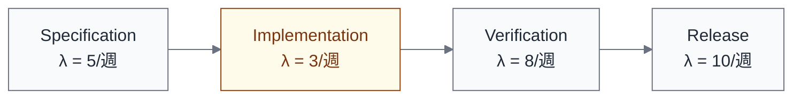

import { Aside } from '@astrojs/starlight/components';

## 3つの理論

動力学モデルは3つの既存理論を参照し、ソフトウェアエンジニアリングの文脈に適用する。

| 理論 | 核心的主張 | 本モデルでの使い方 |
|---|---|---|
| 制約理論（TOC） | システムのスループットは制約によって律速される | ボトルネック移動パターンの分析枠組み |
| バリューストリームマッピング（VSM） | リードタイムの大部分は待ち時間である | フロー変数の定義と測定 |
| Coordination Theory | 調整とは依存関係の管理である | 依存の型ごとの調整コスト分析 |

## 制約理論（Theory of Constraints: TOC）

### 中核命題

> システムのスループットは、その制約（ボトルネック）によって律速される。

制約以外の工程をいくら改善しても、制約が変わらなければ全体のスループットは変わらない。

### TOC の5ステップ

| ステップ | 行動 | AI導入での例 |
|---|---|---|
| 1. **特定** | 制約を見つける | キュー長や待ち時間から、Verification がボトルネックと特定 |
| 2. **活用** | 制約の稼働率を最大化 | レビュアーの負荷分散、レビュー対象の優先度付け |
| 3. **従属** | 他を制約のペースに合わせる | PR並列度制限で Implementation の出力を Verification に従属させる |
| 4. **緩和** | 制約の能力を拡大 | AIレビュー導入、低リスクPRの自動マージ |
| 5. **繰り返し** | 制約が移動したら1に戻る | Verification が解消したら、Release が次の制約に |

<Aside type="tip">
AI導入は主に**ステップ4（緩和）**として作用する。Implementation の制約を AI で緩和すると、制約は Verification & Review に移動する。これがステップ5のトリガーになり、新しいサイクルが始まる。
</Aside>

### ソフトウェア開発への適用

TOC の核心的洞察は「ローカルな最適化はグローバルな改善を保証しない」である。

この例では Implementation のスループット（λ = 3/週）が最小であり、全体のスループットを律速している。Verification（λ = 8/週）をいくら高速化しても、全体のスループットは 3/週 のまま変わらない。

## バリューストリームマッピング（VSM）

### 核心的洞察

> リードタイムの大部分は待ち時間である。

リーン生産方式に由来するフロー分析手法で、ソフトウェア開発では以下の3つの時間を区別する。

| 時間 | 定義 | 例 |
|---|---|---|
| **タッチタイム** | 実際に作業している時間 | コードを書いている時間、レビューしている時間 |
| **待ち時間** | キューで待っている時間 | PR作成後、レビューが始まるまでの時間 |
| **リードタイム** | 要求から納品までの総時間 | タッチタイム + 待ち時間 |

### AI導入との関係

AI がタッチタイムを短縮しても、待ち時間が支配的であればリードタイムは変わらない。

| 項目 | AI導入前 | AI導入後 |
|---|---|---|
| Implementation タッチタイム | 8時間 | 1時間 |
| Verification 待ち時間 | 24時間 | 48時間（PR増加のため） |
| リードタイム | 32時間 | 49時間（悪化） |

この例では、タッチタイムは87%短縮されたが、待ち時間が倍増したためリードタイムはむしろ悪化している。

## Coordination Theory（Malone & Crowston）

### 中核命題

> 調整とは、活動間の依存関係を管理することである。

[依存関係ビュー](/views/view-4-dependency/)で定義した4つの依存型は、それぞれ異なる調整コストを持つ。

| 依存の型 | 調整コスト | AI導入による変化 |
|---|---|---|
| **Producer-Consumer** | 受け渡しのタイミングと品質の管理 | AI生成アーティファクトの品質ばらつきが調整コストを上げうる |
| **Gate** | 完了待ちによるブロッキング | 承認ゲートの自動化で調整コストが下がりうる |
| **Shared Resource** | 競合の回避と割り当て | AI並列実行でリソース競合が増えうる |
| **Synchronization** | 同期点でのブロッキング | AI速度の不均一性で同期コストが変わりうる |

<Aside>
AI導入は依存関係の型自体を変えるわけではないが、各型の**調整コスト**を変える。この変化を事前に予測し、対処を設計するのが動力学モデルの役割である。
</Aside>

## 3理論の統合

3つの理論はそれぞれ異なる問いに答える。

| 問い | 答える理論 | 動力学モデルでの使い方 |
|---|---|---|
| 全体のスループットを律速しているのはどこか？ | TOC | [ボトルネック移動パターン](/dynamics/bottleneck-patterns/) |
| リードタイムはなぜ改善しないのか？ | VSM | [フロー変数](/dynamics/flow-variables/)の分析 |
| 依存関係の調整コストはどう変わるか？ | Coordination Theory | [依存関係ビュー](/views/view-4-dependency/)の動的拡張 |

これらを組み合わせることで、AI導入の効果を**システム全体**で予測し、対処を設計できる。

## model/ との対応

このページの内容は以下のモデルファイルに基づいている。

| セクション | 対応ファイル | 対応箇所 |
|---|---|---|
| 制約理論（TOC） | `model/04e_dynamics.md` | 「2.1 制約理論」セクション |
| バリューストリームマッピング | `model/04e_dynamics.md` | 「2.2 バリューストリームマッピング」セクション |
| Coordination Theory | `model/04e_dynamics.md` | 「2.3 Coordination Theory」セクション |
