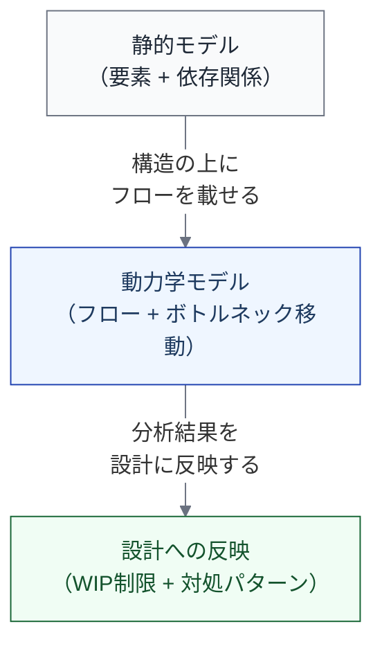

import { Aside } from '@astrojs/starlight/components';

## 要素モデルの限界

ここまでのモデルは「各ステップに何を定義するか」を整理する**要素モデル**として成立している。[基底モデル](/foundation/base-model/)で7要素を定義し、[ライフサイクル](/lifecycle/nine-stages/)でステップの順序を定め、[実行設計](/execution/actor-and-responsibility/)で誰がどう進めるかを記述し、[8つのビュー](/views/overview/)で多角的に投影した。

しかし、要素モデルだけでは以下の問いに答えられない。

| 問い | なぜ要素モデルでは答えられないか |
|---|---|
| Implementation を AI で高速化したら、全体のリードタイムはどうなるか？ | 個々のステップの定義では、ステップ間のフローの変化が見えない |
| Verification にレビュアーを増やしても、なぜスループットが上がらないか？ | 実行設計だけでは、待ち行列やバッチサイズの効果が表現できない |
| AI導入でどこが速くなり、その結果どこが詰まるか？ | 依存関係の静的な構造だけでは、ボトルネックの移動が予測できない |

これらは要素ではなく**フロー**の問いである。要素モデルは「何があるか」を答え、動力学モデルは「何が起きるか」を答える。

## AI生産性パラドックス

AI導入の現場では、直感に反する現象が報告されている。

| 指標 | 変化 |
|---|---|
| タスク完了数 | 増加 |
| PRマージ数 | 大幅増加 |
| PRサイズ | 大幅増大 |
| レビュー時間 | 大幅増加 |
| バグ発生数 | 微増 |
| 組織レベルのリードタイム | 横ばい |

**ローカルな最適化（Implementation の高速化）が、システム全体のスループットを改善しない。**

これは制約理論（Theory of Constraints）の典型例である。「コードを書く速度」がボトルネックであれば、その高速化は全体を改善する。しかし、実際のボトルネックがレビュー、リリース判断、仕様定義にあるなら、コードを速く書いても全体は変わらない。

<Aside type="caution">
AI生産性パラドックスは「AIが役に立たない」ことを意味しない。AI導入の効果を**システム全体**で捉え、ボトルネックの移動に対処する設計が必要であることを意味する。
</Aside>

## 動力学モデルの位置づけ

動力学モデルは、[依存関係ビュー](/views/view-4-dependency/)が定義した**静的な構造**の上に、AI導入がその構造に与える**動的な影響**を載せるものである。

### このセクションで扱うこと

| ページ | 内容 |
|---|---|
| [理論的基盤](/dynamics/theoretical-foundations/) | 制約理論、VSM、Coordination Theory の概要と適用 |
| [フロー変数と測定](/dynamics/flow-variables/) | スループット、リードタイム、WIP 等のフロー変数の定義 |
| [ボトルネック移動の4パターン](/dynamics/bottleneck-patterns/) | AI導入で発生する典型的なボトルネック移動 |
| [WIP制限の設計原則](/dynamics/wip-limits/) | フロー理論から導かれる最も実践的な設計指針 |

### このセクションで扱わないこと

- **定量的シミュレーション** — 具体的な数値予測はチーム固有の変数に依存し、モデルの範囲外
- **待ち行列モデルの厳密な適用** — ソフトウェア開発のバッチサイズ変動性や差し戻しループの非定常性により限界がある
- **組織間の比較** — フロー変数の絶対値は組織ごとに異なる。トレンド（AI導入前後の変化方向）の分析に限る

## model/ との対応

このページの内容は以下のモデルファイルに基づいている。

| セクション | 対応ファイル | 対応箇所 |
|---|---|---|
| 要素モデルの限界 | `model/04e_dynamics.md` | 「1.1 要素モデルの限界」セクション |
| AI生産性パラドックス | `model/04e_dynamics.md` | 「1.2 AI生産性パラドックスとの接続」セクション |
| 限界と今後 | `model/04e_dynamics.md` | 「8. このモデルの限界と今後」セクション |
