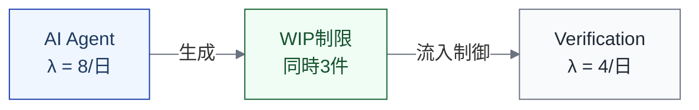
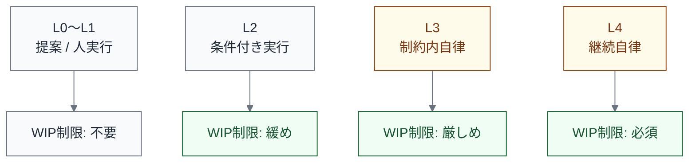

import { Aside } from '@astrojs/starlight/components';

## なぜ WIP 制限が有効か

[リトルの法則](/dynamics/flow-variables/#リトルの法則)より、リードタイムはWIPとスループットの比で決まる。

> **T_lead = WIP / λ**

λ（スループット）が一定であれば、WIP を減らすことがリードタイム短縮の唯一の方法である。AI導入で λ(Implementation) が上がっても、λ(Verification) が追いつかなければ WIP が増えるだけでリードタイムは改善しない。

WIP制限は、フロー理論から導かれる最も実践的な設計指針である。

## AI文脈での WIP 制限

### 具体例

| WIP制限 | 対応する制御 | 効果 |
|---|---|---|
| **同時実行エージェント数の上限** | オーケストレーターの max_concurrent 設定 | 下流への流入量を直接制限 |
| **オープンPR数の上限** | PR並列度制限（同時3件以下等） | Verification へのキュー長を制限 |
| **PRサイズの上限** | PRサイズゲート（800行超でブロック等） | レビュー負荷を制限し、差し戻し率を下げる |
| **差し戻し中タスクの優先処理** | 新規タスクより差し戻し修正を優先 | 差し戻しループによるWIP増加を抑制 |

### WIP制限のメカニズム

AI Agent のスループット（λ = 8/日）が Verification のスループット（λ = 4/日）を上回る場合、WIP制限なしでは Verification の前にキューが際限なく溜まる。WIP制限（同時3件）を設けることで、AI Agent は Verification が追いつくまで新規タスクの開始を待つ。

<Aside type="tip">
WIP制限はAIの能力を「制限」しているように見えるが、実際にはシステム全体のリードタイムを短縮する。局所的な速度より、全体のフローを優先する設計である。
</Aside>

## 裁量レベルとの関係

[裁量レベル](/execution/raci-and-discretion/)を上げると、AIの自律性が上がりWIPが増えやすい。WIP制限は裁量レベルの引き上げに対する**カウンターバランス**として機能する。

| 裁量レベル | WIPリスク | 推奨WIP制限 | 理由 |
|---|---|---|---|
| **L0〜L1** | 低 | 不要 | 人間の実行速度がWIPを自然に制限 |
| **L2** | 中 | 緩め（同時5件等） | AIが実行するが承認がブレーキになる |
| **L3** | 高 | 厳しめ（同時3件等） | AIが自律的にタスクを進め、WIPが急増しやすい |
| **L4** | 非常に高 | 必須 | AIが常時稼働するため、オーケストレーターに組み込む |

## 設計原則

### 原則1: 下流のスループットに合わせる

WIP制限は、下流のステップのスループットに合わせて設定する。Implementation の出力を Verification が消化できる速度に合わせる。

### 原則2: 差し戻しを優先する

差し戻されたアイテムは、新規アイテムより優先して処理する。差し戻しループの高速回転がWIPを膨らませるのを防ぐ。

### 原則3: 段階的に調整する

WIP制限の適切な値は、チームやプロダクトのコンテキストに依存する。最初は緩めに設定し、フロー変数を観測しながら調整する。

| 観測指標 | WIP制限を厳しくする兆候 | WIP制限を緩める兆候 |
|---|---|---|
| キュー長（Q） | Verification の前にPRが溜まり続ける | キューがほぼ空でAIが待機状態 |
| 待ち時間（T_wait） | レビュー待ちが増加傾向 | レビュー待ちが安定 |
| 差し戻し率（R_rework） | 差し戻し率が上昇 | 差し戻し率が低下 |
| リードタイム（T_lead） | リードタイムが悪化傾向 | リードタイムが安定 |

### 原則4: 制御環境に組み込む

WIP制限は「ルール」ではなく「仕組み」として実装する。

| 実装レベル | 方法 | 効果 |
|---|---|---|
| ポリシー | チーム内の合意（「同時3件まで」） | 意識すれば守れるが、忘れがち |
| ツール設定 | オーケストレーターの max_concurrent | 自動的に制限される |
| CI/CDゲート | オープンPR数が閾値を超えると新規PRをブロック | 仕組みとして強制される |

<Aside>
裁量レベルが高いほど、ポリシーではなくツール設定やCI/CDゲートでWIP制限を実装するべきである。L4（継続自律）で「チーム内の合意」に頼るのは、実効性が低い。
</Aside>

## 他のモデル要素との接続

| モデル要素 | WIP制限との関係 |
|---|---|
| [裁量レベル](/execution/raci-and-discretion/) | 裁量レベルの引き上げに対するカウンターバランス |
| [制御環境ビュー](/views/view-5-control/) | WIP制限は制御環境の一部として記述する |
| [測定ビュー](/views/view-7-measurement/) | フロー変数の観測によりWIP制限の適切さを検証する |
| [ボトルネック移動パターン](/dynamics/bottleneck-patterns/) | TOC の「従属」ステップとして WIP 制限を適用する |
