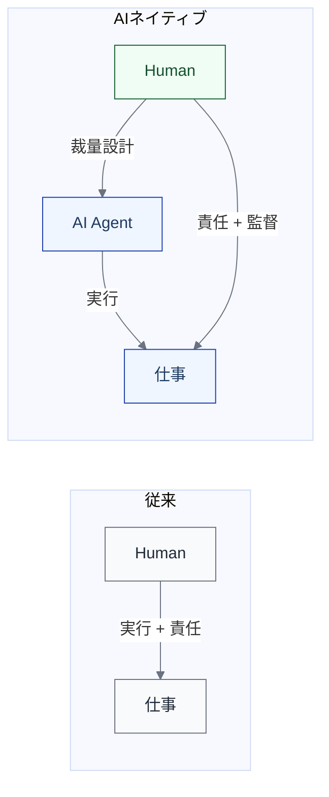

import { Aside } from '@astrojs/starlight/components';

## なぜ実行主体と責任主体を分けるのか

AIエージェントがコードを書き、テストを生成し、PRを出す。このとき「誰がやっているのか」と「誰が責任を持つのか」は、同じに見えて別の問いである。

従来の開発では、実行主体と責任主体はほぼ一致していた。コードを書いた人がそのコードに責任を持つ。しかし、AIが実行を担うようになると、この一致が崩れる。AIは実行できるが、最終責任を引き受ける主体にはなれない。

この区別を明確にしないと、以下の問題が生じる。

- **責任の空白** — AIが書いたコードに誰も責任を持たない状態
- **過剰な信頼** — AIが出力したものを検証なしに受け入れる慣行
- **ガバナンスの不在** — 障害発生時に誰が判断し、誰が対処するかが不明

実行設計とは、各ライフサイクルステップについて「誰が実行するか」「誰が責任を持つか」「どこまで委譲するか」を定義する領域である。

## 実行主体とは

**実行主体（Actor）とは、与えられた権限と文脈のもとで、仕事の状態を前進させる行為を実行できる単位である。**

実行主体には以下の4種類がある。

| 種類 | 説明 | 例 |
|---|---|---|
| **Human** | 人間の開発者・レビュアー・PO | エンジニア、テックリード、プロダクトオーナー |
| **AI Agent** | 自律的にタスクを遂行するAI | Claude Code、Codex CLI、GitHub Copilot coding agent |
| **Automation / System** | 条件成立後に自律的に次工程を進める仕組み | GitHub Actions、CI/CD パイプライン、スケジューラ |
| **External Actor** | 組織外の主体 | 外部ベンダー、顧客、規制機関 |

### 実行主体に含めないもの

以下はすべて実行主体に**含めない**。

- IDE、検索、リンター、テストランナー
- MCP サーバー、スキル、プロンプトテンプレート
- ドキュメント、ナレッジベース
- ハーネス

<Aside type="tip">
これらは「主体」ではなく、**能力**（Actor の手足）、**媒介物**（仕事を流すもの）、**制御環境**（安全に回すための条件）として扱う。「誰が」ではなく「何を使って」「何に守られて」の側に位置づける方が整理しやすい。
</Aside>

### 境界が曖昧になるケース

GitHub Actions やスケジューラのように、条件が成立すると**自律的に次工程を進める**ものは Automation / System として実行主体に含める。一方、リンターやテストランナーは CI の中で呼び出される道具であり、実行主体ではなく制御環境の一部として扱う。

判断基準は「それ自体がワークフローの次のステップを起動するか」である。起動するなら実行主体、呼び出されて検査するだけなら制御環境である。

## 責任主体とは

AIは実行主体にはなれるが、**責任主体は通常 Human または Team に残る**。

責任主体には少なくとも以下の役割が含まれる。

| 役割 | 説明 |
|---|---|
| **最終責任者** | 成果物の品質・正しさについて最終的に答える人 |
| **リスク受容者** | AIの出力を本番に反映するリスクを受け入れる人 |
| **承認責任者** | ゲートを通過させる判断を下す人 |

<Aside type="caution">
AIネイティブ化とは、責任の移譲ではない。**逐次チェックを減らしても安全に回る範囲を設計すること**に近い。AIに実行を任せるほど、責任主体の設計と制御環境の整備が重要になる。
</Aside>

## 具体例: Verification & Review の実行主体と責任主体

L1「Verification & Review」を例に、実行主体と責任主体の割り当てを示す。

| L2 ステップ | 実行主体 | 責任主体 |
|---|---|---|
| 自動検証（CI） | Automation（CI/CD） | Team（CI 設計の責任） |
| AI 一次レビュー | AI Agent（コードレビュー AI） | Human（レビュー品質の責任） |
| 人レビュー | Human（レビュアー） | Human（レビュアー本人） |
| 差し戻し判断 | Human（レビュアー） | Human（レビュアー本人） |
| 修正反映確認 | AI Agent + Automation | Human（マージ判断の責任） |

この例で重要なのは、AIが一次レビューを実行しても、レビュー品質の最終責任は人に残るという点である。AIレビューが見落としたバグの責任は、AIではなく、AIレビューの設計・運用に責任を持つ人に帰属する。

## 責任の実効性

責任主体を人に置くと定義しても、それだけで責任が機能するわけではない。責任主体に、検証するための実質的な能力・時間・情報がなければ、承認は儀式になり、責任は形式だけのものになる。組織図上の責任と実効的な責任は別物である。

前節の例で言えば、「マージ判断の責任は Human にある」と定義していても、その人がAIの出力を検証できる状態にないまま承認しているなら、責任主体の設計は紙の上でしか機能していない。障害が起きたとき「承認者はいたが、承認者には見抜きようがなかった」という状態は、冒頭で挙げた**責任の空白**が形を変えて再来したものである。

<Aside type="caution">
形式化した責任は、問題が起きるまで発見されにくい。承認フローは動いており、記録も残っているため、外形上は健全に見える。実効性は「承認が差し戻しに転じることがあるか」「承認者が判断の根拠を説明できるか」といった振る舞いでしか観測できない。
</Aside>

### 実効性はどう侵食されるか

責任の形式化は、誰かが意図して起こすものではない。AIネイティブ化を進める過程で、以下のメカニズムが静かに進行する。

**評価の多層化による形式化** — AIが一次レビューや品質判定を担うほど（この役割は[AIの多面性](/execution/ai-four-facets/)で Evaluator として整理する）、人の承認は「AIが通したものを通す」作業に近づく。AIの判定精度が高いほど人が差し戻す機会は減り、差し戻さない承認が続くほど、承認は検証としての中身を失っていく。

**監督能力の萎縮という遅いループ** — 実行をAIに委ねるほど、人は監督能力の源泉だった実地経験を失っていく。コードを書かなくなったレビュアーは、コードの問題を見抜く感覚を徐々に失う。これは[動力学](/dynamics/why-dynamics/)が扱うフローの変化（数週間で観測できる速いループ）と対比される、能力の遅いフィードバックループである。数ヶ月から数年の単位で進行し、気づいた時点では回復が難しい。

これらのメカニズムは互いに強め合う。AIの評価を信頼するほど人は検証しなくなり、検証しなくなるほど検証する能力そのものが失われる。

### 実効性を維持する設計

したがって本モデルでは、責任主体を割り当てるだけでなく、**責任主体が責任を果たせる状態の維持**自体を設計変数として扱う。対処の方向性を以下に示す。

| 方向性 | 対応する設計 | 例 |
|---|---|---|
| 理解可能な粒度への要約 | アーティファクトの設計 | 承認者が判断に使える粒度の変更サマリー、判断根拠の明示 |
| 抜き打ち検証 | 制御環境の設計 | サンプリングレビュー、AIが通した成果物の定期的な精査 |
| 監督能力の維持 | 実行設計 | あえて裁量レベルを下げたステップを残す、承認担当のローテーション |

これらはいずれも「AIへの委譲を戻す」のではなく、委譲を維持したまま責任主体の検証能力を保つための設計である。抜き打ち検証は全件チェックへの回帰ではないし、裁量レベルを下げたステップを残すのは効率の犠牲ではなく、監督能力という資産への投資である。

この観点は、次ページで扱う[裁量レベルの選定基準](/execution/raci-and-discretion/#裁量レベルの選定基準)にも接続する。裁量レベルを上げる判断では、失敗時の影響や可逆性に加えて、「責任主体の検証能力が維持されているか」を問う。検証能力が萎縮した状態で裁量レベルだけを上げるのは、責任の空白を設計に埋め込むことに等しい。

## AIネイティブ化で何が変わるか

実行主体と責任主体の関係は、AIの導入によって以下のように変化する。

変化の要点は以下である。

1. **実行主体の多様化** — Human だけでなく AI Agent が R（実行）に入る
2. **責任と実行の分離** — 実行する主体と責任を持つ主体が異なるケースが増える
3. **監督の設計が必須に** — 責任主体は直接手を動かさない代わりに、AIの裁量範囲を設計し、制御環境を整備し、結果を監督する

この「裁量の範囲設計」を体系的に扱うのが、次ページで解説する[裁量レベル（L0〜L4）](/execution/raci-and-discretion/)である。
