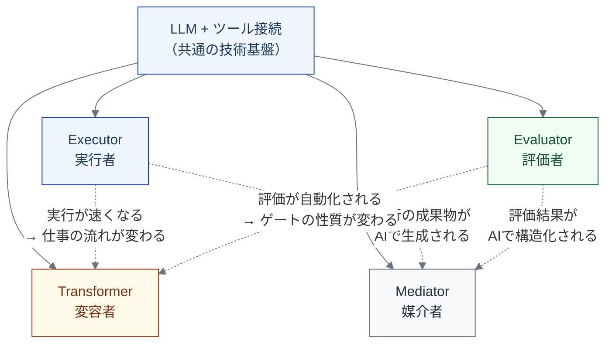

import { Aside } from '@astrojs/starlight/components';

## なぜ「AI = 実行主体」だけでは足りないか

[実行主体と責任主体](/execution/actor-and-responsibility/)では、AIを Actor（実行主体）の一種として定義した。これは正しいが、不十分である。

実際のAIネイティブなワークフローでは、同じLLM技術が以下のすべてに現れる。

| 現れ方 | 例 | 基底モデルの要素 |
|---|---|---|
| コードを書く | Claude Code、Codex CLI | Actor |
| コードをレビューする | Copilot code review、CodeRabbit | Actor **かつ** Control |
| テストの合否を評価する | LLM-as-judge | Control **かつ** Metric |
| PRの要約を生成する | Changelog AI | Artifact |
| 差し戻し先を分析する | AI影響分析 | Actor **かつ** Dependency |
| ルールファイルを解釈して自身の行動を制約する | CLAUDE.md、.cursorrules | Control（制御される側として） |

つまり、AIは1つのライフサイクルステップの中で、Actor であると同時に Control 環境の一部でもあり、Artifact の生成・消費の仕方を変え、Metric の計測手段にもなる。

「AI = 実行主体」としか捉えないと、以下の問題が生じる。

- **設計時** — 制御環境ビューや測定ビューにおけるAIの役割が暗黙的になる
- **適用時** — 「AIがコードを書く」と「AIがlint失敗を分析して修正する」を区別できない
- **マチュリティ判断時** — 実行の移譲と検証の移譲が同じLLMで起きるケースへの対処が不明

## 4つのファセット

AIが[基底モデルの7要素](/foundation/base-model/)にどう関与するかを分析すると、4つの異なるファセット（顔）が浮かび上がる。

### Executor（実行者）

> 仕事の状態を直接前進させる

- **対応する基底要素**: Actor
- **例**: コード生成、テスト作成、ドキュメント生成、変更実装
- **[裁量レベル](/execution/raci-and-discretion/)**: L0〜L4 で段階的に設計する
- **既存モデルでの位置**: 05（実行設計）で定義済み

これが最も馴染みのあるファセットであり、「AIがコードを書く」はここに該当する。

### Evaluator（評価者）

> 仕事の品質・正しさを判定する

- **対応する基底要素**: Control + Metric
- **例**: AIコードレビュー、LLM-as-judge、テスト合否の分析、セキュリティスキャン
- **裁量レベル**: L0〜L4 で段階的に設計する
- **既存モデルでの位置**: 制御環境ビューで部分的に登場

Evaluator は「実行する」のではなく「判定する」。AIレビューが「このコードは問題ない」と判断するとき、それは Control（品質ゲート）としての機能であり、同時に Metric（品質指標の計測）としての機能でもある。

<Aside type="caution" title="Executor と Evaluator の分離原則">
同じLLMが Executor（コードを書く）と Evaluator（コードをレビューする）を兼ねる場合、評価の独立性に問題が生じる。自己評価バイアス（自分が書いたコードの問題を見つけにくい）を避けるため、最低でもセッションを分離し、可能ならモデルを分離する。LLM Evaluator は従来のリンターやSASTの代替ではなく補完として位置づける。
</Aside>

### Transformer（変容者）

> 仕事の構造・粒度・流れ方を変える

- **対応する基底要素**: Dependency + Lifecycle Step（間接的に）
- **例**: タスク自動分解による粒度の変化、PR生成速度の変化によるレビューボトルネック、テスト先行の強制による依存構造の変化
- **裁量レベル**: 該当しない（これは委譲ではなく、AIの導入による構造的な効果）
- **既存モデルでの位置**: インスタンスの「仕事の重心の移動」として記述

Transformer は意図的に設計するものではなく、Executor や Evaluator の導入の**結果として生じる**構造変化である。だからこそ見落とされやすい。

### Mediator（媒介者）

> 仕事の入出力のかたちを変える

- **対応する基底要素**: Artifact
- **例**: PR要約の自動生成、構造化された差し戻し理由、ルールファイルの解釈
- **裁量レベル**: 該当しない
- **既存モデルでの位置**: 暗黙的

AI が Artifact の生成・消費パターンそのものを変える。AI生成PRは変更量が均一になりやすく、人間が書くPRとは粒度やスタイルが異なる。この違いを無視すると、後工程（レビュー、テスト）の設計が現実とずれる。

## 4ファセットの全体像

4つのファセットは独立ではなく、同一のLLM技術基盤の上に成立する。同じLLMインスタンスが同時に複数のファセットを持ちうる。

**色の意味**:
- 青（To-Be）: Executor — AIが直接担う実行の役割
- 緑（制御）: Evaluator — 品質判定・ゲートとしての役割
- 黄（警告）: Transformer — 意図せず発生しうる構造変化。設計時に意識しないと見落とす
- グレー（中立）: Mediator — Artifact の形式変化

### ファセット間の因果関係

| 因果 | メカニズム | 例 |
|---|---|---|
| Executor → Transformer | 実行速度が上がると、後工程のボトルネックが移動する | Implementation 高速化 → Verification のレビュー疲れ |
| Executor → Mediator | AIが生成する Artifact は、人間が書くものと形式・粒度が異なる | AI生成PRは変更量が均一になりやすい |
| Evaluator → Transformer | 評価の自動化がゲートの性質を変え、ワークフローのパスが増える | 低リスクPRの自動マージにより、人レビューを bypass するパスが生まれる |
| Evaluator → Mediator | 評価結果が構造化されて記録されると、後工程の Artifact の質が変わる | AI差し戻し理由の構造化 → 修正者が修正箇所を特定しやすくなる |

## 基底モデルとの接続

4ファセットは基底モデルの7要素に新しい要素を追加するものではない。既存の要素の中で、AIがどのように振る舞うかの**横断的な分類**である。

| ファセット | 主な基底要素 | モデルへの影響 |
|---|---|---|
| Executor | Actor | 定義を変える必要はない。AI Agent は引き続き Actor の一種 |
| Evaluator | Control + Metric | Control の定義を拡張する。「人間が設定するルール」だけでなく「AIが担う品質判定」を含める |
| Transformer | Dependency | Dependency の理解を深める。AIが依存関係の構造自体を変えることを認める |
| Mediator | Artifact | Artifact の記述を拡張する。AIが生成・消費パターンを変えることを認める |

<Aside>
4ファセットはモデルを壊すものではなく、既存の枠組みの中でAIの振る舞いを見る解像度を上げるためのレンズである。
</Aside>

## インスタンス化時のチェックリスト

ライフサイクルの各ステップにAIを導入する際、以下の4つの問いを確認する。

| 問い | ファセット | 見落とすリスク |
|---|---|---|
| このステップでAIは何を**実行する**か？ | Executor | — （通常は見落とさない） |
| このステップでAIは何を**評価・判定する**か？ | Evaluator | AIレビューや LLM-as-judge が制御環境に入っていない |
| このステップでAIの導入は仕事の**流れ方をどう変える**か？ | Transformer | ボトルネック移動や新しい依存パスの見落とし |
| このステップでAIは**入出力の Artifact をどう変える**か？ | Mediator | AI生成 Artifact と人間生成 Artifact の品質差への無自覚 |

最初の問い（Executor）は誰もが考える。重要なのは、残りの3つを意識的に問うことである。特に Transformer（流れ方の変化）は、AIの導入が成功した後に初めて顕在化する問題であり、事前に想定しておくことで対処が容易になる。

## このモデルで扱わないこと

- **AI の内部アーキテクチャ** — transformer、attention、context window 等。本モデルは AI をブラックボックスとして扱い、入出力と振る舞いの契約で記述する
- **特定ツールの選定** — どのLLMを Executor に、どのLLMを Evaluator に使うかは運用判断であり、モデルの範囲外
- **AI の法的責任** — 責任主体は Human / Team に残るという原則を維持する。4ファセットはAIの振る舞いの分類であり、責任の分類ではない

## model/ との対応

このページの内容は以下のモデルファイルに基づいている。

| セクション | 対応ファイル | 対応箇所 |
|---|---|---|
| 4ファセットの定義 | `model/05a_ai_multifaceted_nature.md` | 「AIの4つの顔」セクション |
| ファセット間の因果関係 | `model/05a_ai_multifaceted_nature.md` | 「4ファセットの関係性」セクション |
| 基底モデルとの接続 | `model/05a_ai_multifaceted_nature.md` | 「基底モデルとの接続」セクション |
| インスタンス化チェックリスト | `model/05a_ai_multifaceted_nature.md` | 「設計への実践的な影響」セクション |
| Evaluator の分離原則 | `model/05a_ai_multifaceted_nature.md` | 「Evaluator の分離原則」セクション |
