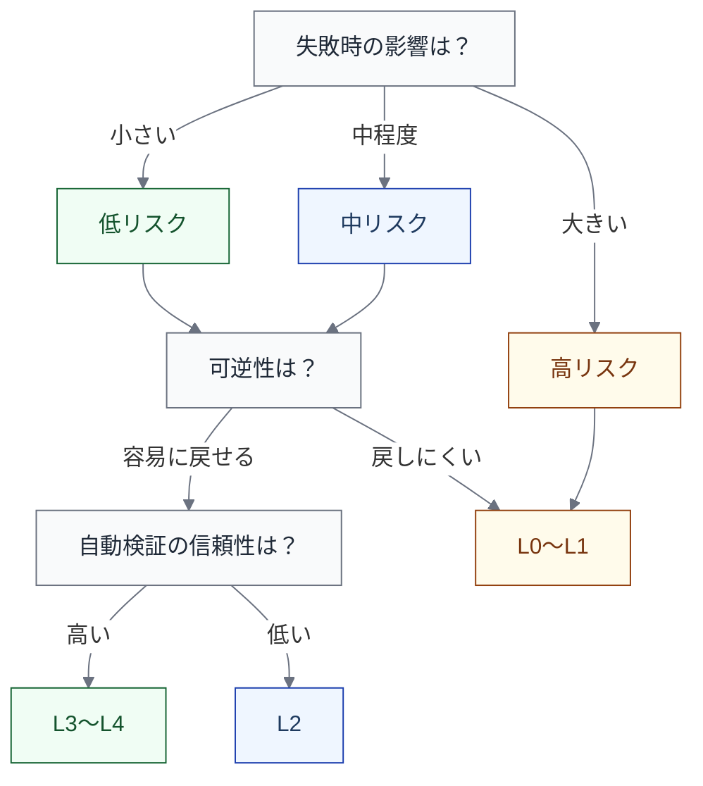

import { Aside } from '@astrojs/starlight/components';

## なぜRACIと裁量レベルが必要か

[前ページ](/execution/actor-and-responsibility/)で、実行主体と責任主体を分けることの重要性を示した。しかし「誰が実行し、誰が責任を持つか」を決めただけでは、AIへの委譲の**程度**が表現できない。

同じ「AIが実行する」でも、以下の状況は大きく異なる。

- AIが提案を出し、人が毎回判断して実行する
- AIが条件の範囲内で自律的に実行し、人は事後に確認する
- AIが継続的に自律実行し、人はポリシーと監視で制御する

この「どこまで任せるか」の段階を表現するために、RACI マトリクスと裁量レベルを組み合わせて使う。

## RACI マトリクス

RACI は、仕事の責任分担を以下の役割で整理するフレームワークである。

| 役割 | 意味 | AIネイティブでの使い方 |
|---|---|---|
| **R** (Responsible) | 実行する主体 | AI Agent を入れてよい |
| **A** (Accountable) | 最終的に責任を持つ主体 | 原則 Human / Team に残す |
| **C** (Consulted) | 相談先 | AI を C に置くこともできる（例: 設計案の壁打ち） |
| **I** (Informed) | 共有先 | AIの出力結果を誰に共有するかを明示する |

### RACI の適用例: Implementation

| L2 ステップ | R | A | C | I |
|---|---|---|---|---|
| 文脈収集 | AI Agent | Human（開発者） | — | — |
| 変更実装 | AI Agent | Human（開発者） | Human（テックリード） | — |
| テスト作成 | AI Agent | Human（開発者） | — | — |
| ローカル整合確認 | Automation + AI Agent | Human（開発者） | — | Team |

### RACI だけでは足りないもの

RACI は「誰が何をするか」を整理するには有効だが、以下の設計要素をカバーしない。

| 足りないもの | 説明 |
|---|---|
| **裁量レベル** | R に AI が入ったとき、どこまで自律的に動けるか |
| **ゲート条件** | 次のステップに進むために必要な条件 |
| **フォールバック** | AIが失敗したときの代替手順 |
| **依存関係** | このステップが何に依存しているか |
| **制御環境** | 実行を安全にするための仕組み（リンター、CI、ポリシー等） |

だから RACI は道具の1つであり、これだけで実行設計が完結するわけではない。

## 裁量レベル（L0〜L4）

AIや自動化の入り込み方の程度を段階で表す。

| レベル | 名称 | AIの振る舞い | 人の関与 |
|---|---|---|---|
| **L0** | 提案のみ | 提案を生成する。実行はしない | 毎回判断し、実行する |
| **L1** | 提案 + 人が実行 | 具体的な実行案（コード差分、コマンド等）を提示する | 提案を確認し、採否を判断して実行する |
| **L2** | 条件付き実行 + 人承認 | 定められた条件の範囲内で実行する。承認を待ってから確定する | 実行結果を承認または差し戻す |
| **L3** | 制約内で自律実行 + 事後確認 | 制約の範囲内で自律的に実行し、結果を報告する | 事後に結果を確認する。逸脱時に介入する |
| **L4** | 継続自律実行 + 監視/ポリシー制御 | 継続的に自律実行する。ポリシーに従い、監視可能な状態を維持する | ポリシーを設計し、監視する。異常時に介入する |

<Aside type="tip">
裁量レベルは「AIの賢さ」ではなく「人がどこで関与するか」の設計である。同じAIでも、リスクの高いステップでは L1 に、低リスクの定型作業では L3 に設定するのが自然である。
</Aside>

### 裁量レベルの選定基準

裁量レベルは、以下の軸で判断する。

- **失敗時の影響** — 本番障害に直結するか、開発者のローカルで閉じるか
- **可逆性** — ロールバックやリバートが容易か
- **自動検証の信頼性** — CI、テスト、リンターで誤りを検出できるか

### 具体例: 同じAIでもステップによって裁量レベルは異なる

| ステップ | 裁量レベル | 理由 |
|---|---|---|
| テストコードの生成 | L3 | 失敗しても影響はローカル。CI で自動検証可能 |
| 実装コードの変更 | L2 | 影響範囲が広い可能性あり。人の承認を挟む |
| 本番リリース判断 | L0 | 不可逆で影響大。AIは情報提供のみ、判断は人 |
| リンター違反の自動修正 | L4 | 決定論的なルールに基づく修正。継続自律で問題ない |

## RAPID との使い分け

RACI が「作業責任」の整理に適しているのに対し、RAPID は「意思決定責任」の整理に適している。

| 場面 | 使うフレームワーク | 理由 |
|---|---|---|
| 各 L2 ステップの実行責任 | RACI | 実行・承認・相談・共有の分担を整理する |
| リリース Go/No-Go 判断 | RAPID | 推奨・合意・実行・決定・共有の意思決定プロセスを整理する |
| インシデント対応の判断 | RAPID | 誰が決定権を持つかが特に重要 |

すべてのステップに RAPID を適用する必要はない。日常の作業責任は RACI で十分であり、RAPID は重い意思決定（Framing、Specification、Release、Incident 対応など）に限定して使うのがよい。

## 実行設計ビューの推奨項目

各ライフサイクルステップの実行設計を完全に記述するには、RACI と裁量レベルに加えて以下の項目を定義する。

| # | 項目 | 説明 |
|---|---|---|
| 1 | **RACI** | 実行・責任・相談・共有の割り当て |
| 2 | **裁量レベル** | L0〜L4 のどこに設定するか |
| 3 | **トリガー** | このステップの開始条件（何が起きたら始まるか） |
| 4 | **ゲート** | 次のステップに進むための条件（何が満たされたら進めるか） |
| 5 | **フォールバック** | AIが失敗したときの代替手順 |
| 6 | **入力アーティファクト** | このステップが受け取るもの |
| 7 | **出力アーティファクト** | このステップが生成するもの |
| 8 | **観測点** | このステップで計測すべきもの |

<Aside>
すべてのステップで8項目すべてを埋める必要はない。重要なのは、AIの裁量を広げるステップほど、ゲート・フォールバック・観測点の設計を意識的に行うことである。
</Aside>

## AIネイティブ化で現れる変化

RACI と裁量レベルの観点から、AIネイティブな変化は主に以下の形で現れる。

| 変化 | 説明 |
|---|---|
| **R に AI Agent が入る** | 従来 Human だけだった実行を AI が担う |
| **裁量レベルが上がる** | L0（提案のみ）から L2〜L3（自律実行）へ移行する |
| **I の重要性が上がる** | AIの実行結果を「誰に、どう共有するか」の設計が重要になる |
| **逐次承認が減り、事後確認が増える** | 人の関与が事前承認から事後監視へシフトする |

この変化は、制御環境と測定の設計なしには安全に進められない。裁量レベルを上げるということは、ゲートの自動化、フォールバックの整備、観測点の充実をセットで進めることを意味する。
