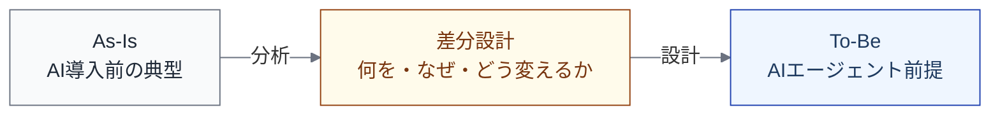

import { Aside } from '@astrojs/starlight/components';

## 適用例とは何か

ここまでのセクションでは、AIネイティブSEモデルの**枠組み**を定義してきた。基底モデル、ライフサイクル、実行設計、ビュー体系、動力学。これらは「何を定義すべきか」を示すが、「具体的にどう埋めるか」は示していない。

適用例（インスタンス）は、この枠組みを**特定のコンテキストに適用した結果**である。ライフサイクルの特定のステップについて、実行設計、制御環境、As-Is/To-Be の比較を具体的に記述したものになる。

## 変換モードとは

本セクションで提供する適用例は**変換モード**で記述されている。変換モードとは、As-Is（AI導入前の典型的な状態）から To-Be（AIエージェント前提の状態）への差分設計である。

各適用例は冒頭に**インスタンス化宣言**を持ち、以下の5つの項目を明示する。

| 項目 | 説明 |
|---|---|
| **対象** | どのL1ステップ（とそのL2分解）を扱うか |
| **モード** | 変換（As-Is → To-Be の差分設計） |
| **コンテキスト** | チーム規模、プロダクト特性、前提条件 |
| **埋めるビュー** | どのビューを具体化するか |
| **参照した調査資産** | どの調査結果をインプットにしたか |

## 適用例の構造

各適用例は以下の構造で記述されている。

### 1. 実行設計ビュー: As-Is → To-Be

L2ステップごとに、RACI・裁量レベル・協調様式の As-Is と To-Be を比較する。差分の設計判断（何を・なぜ・前提条件）も記述する。

### 2. 制御環境ビュー: To-Be

AI Agent が実行主体になることで必要になる制御環境を、L2ステップごとに記述する。各制御の設計根拠（なぜその制御が必要か）も含む。

### 3. As-Is / To-Be 比較ビュー

実行主体の変化、仕事の重心の移動、裁量レベルの段階的引き上げを記述する。

### 4. 依存関係（補足）

L2間の依存構造が As-Is → To-Be でどう変わるかを記述する。前後のL1ステップとの外部依存も含む。

### 5. Validation の観点

設計が「設計図倒れ」にならないために、実運用で検証すべき指標を定義する。

## 読み方のコツ

<Aside type="tip">
適用例はそのままコピーして使うものではない。自分のコンテキスト（チーム規模、プロダクト特性、リスク許容度）に合わせて**テーラリング**するための出発点として読む。
</Aside>

### 自分のコンテキストに合わせるポイント

| 確認すべき点 | 合わない場合の対処 |
|---|---|
| **チーム規模** | 適用例は5〜15名を想定。少人数なら制御を簡素化、大規模ならクロスチーム調整を追加 |
| **プロダクト特性** | 適用例はWebアプリを想定。組み込みやデータパイプラインでは制御環境の重点が変わる |
| **裁量レベルの出発点** | 適用例はL2〜L3を To-Be としている。まずL1から始めて段階的に上げてもよい |
| **制御環境の前提** | テストカバレッジやCI/CDの整備状況によって、適用可能な制御が変わる |

### 2つの適用例の関係

本セクションでは以下の2つの適用例を提供する。

| 適用例 | 対象L1 | 関係 |
|---|---|---|
| [Implementation: 変換モード](/instances/implementation/) | Implementation | 最初に取り組む。AI実行の委譲設計 |
| [Verification & Review: 変換モード](/instances/verification-review/) | Verification & Review | Implementation の後工程。ボトルネック移動の受け手 |

この2つは独立ではない。Implementation の高速化が Verification & Review のボトルネック移動を引き起こすという[動力学的な因果関係](/dynamics/bottleneck-patterns/#パターン1-implementation--verification-移動)で接続されている。
