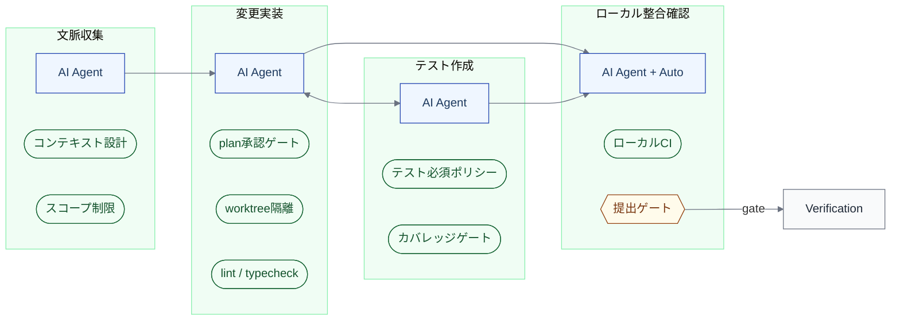
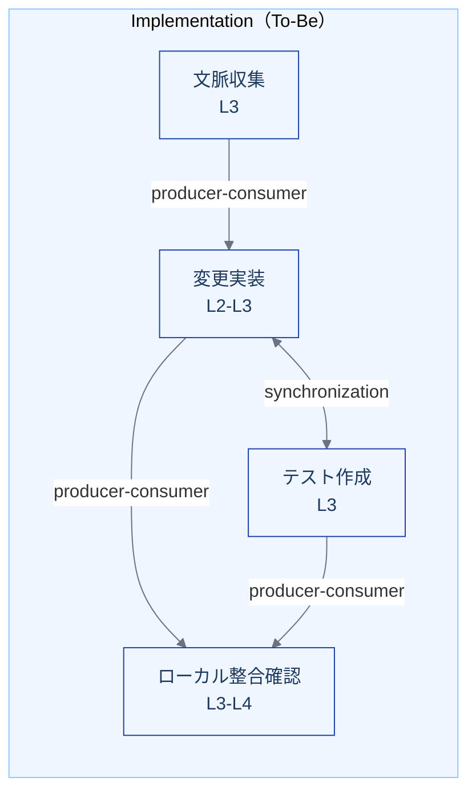

import { Aside } from '@astrojs/starlight/components';

## インスタンス化宣言

| 項目 | 値 |
|---|---|
| **対象** | Implementation（L1）— 文脈収集 / 変更実装 / テスト作成・更新 / ローカル整合確認 の各L2 |
| **モード** | 変換（As-Is → To-Be の差分設計） |
| **コンテキスト** | Webアプリケーション開発チーム（5〜15名）、モノレポまたは少数リポジトリ、CI/CD整備済み |
| **埋めるビュー** | 実行設計ビュー、制御環境ビュー、As-Is/To-Beビュー、依存関係（補足） |

## 1. 実行設計ビュー: As-Is → To-Be

### As-Is（AI導入前の典型）

人間がすべてのL2を実行し、AIはコード補完程度。

| L2 | R（実行） | A（責任） | 裁量レベル | 協調様式 |
|---|---|---|---|---|
| 文脈収集 | Human | Human（担当者） | — | 単独（必要時に口頭相談） |
| 変更実装 | Human | Human（担当者） | — | 単独 or ペアプロ |
| テスト作成・更新 | Human | Human（担当者） | — | 単独 |
| ローカル整合確認 | Human + Automation | Human（担当者） | — | 逐次（手動実行→確認） |

### To-Be（AIエージェント前提）

AIエージェントが実行し、人間が重要判断ポイントで承認する。

| L2 | R（実行） | A（責任） | 裁量レベル | 協調様式 |
|---|---|---|---|---|
| 文脈収集 | AI Agent | Human（担当者） | L3 | 委譲（制約内で自律） |
| 変更実装 | AI Agent | Human（担当者） | L2〜L3 | 条件付き委譲（plan承認 or 制約内自律） |
| テスト作成・更新 | AI Agent | Human（担当者） | L3 | 委譲（受け入れ条件に基づく自律） |
| ローカル整合確認 | AI Agent + Automation | Human（担当者） | L3〜L4 | 自律（失敗時のみ人間介入） |

### 差分の設計判断

| L2 | 何が変わるか | なぜ変えるか | 前提条件 |
|---|---|---|---|
| 文脈収集 | R が Human → AI Agent。AIがコードベース検索・依存関係分析を自律的に行う | 人間の文脈収集は時間がかかり見落としが多い | ルールファイル（CLAUDE.md等）の整備、コンテキスト設計が済んでいること |
| 変更実装 | R が Human → AI Agent。裁量レベルがL2〜L3に | 定型的なコード変更はAIが速く、人間は設計判断に集中できる | テストカバレッジ ≥ 60%、worktree隔離が利用可能 |
| テスト作成・更新 | R が Human → AI Agent。受け入れ条件からテストケースを自律生成 | テストの後回しを構造的に防げる | 受け入れ条件が Specification で定義済み |
| ローカル整合確認 | 手動確認 → AI Agent + Automation の自律実行 | lint / typecheck / unit test の実行と結果判定はほぼ完全に自動化可能 | ローカルCI環境が再現可能であること |

## 2. 制御環境ビュー: To-Be

AI Agent が R になることで、人間の逐次確認が減る代わりに**仕組みとしての制御**が増える。

### L2 ごとの制御環境

#### 文脈収集

| 制御の種類 | 主体 | 内容 |
|---|---|---|
| コンテキスト設計 | Human（事前設定） | ルールファイル、.claudeignore、プロジェクト構造の明文化 |
| スコープ制限 | ポリシー | AIが参照できるファイル・ディレクトリの範囲制限 |

#### 変更実装

| 制御の種類 | 主体 | 内容 |
|---|---|---|
| 実行隔離 | Automation | git worktreeによる変更の隔離 |
| plan承認ゲート | Human | 実装計画の事前承認（L2の場合） |
| 自動検証（即時） | Automation | lint / typecheck の変更直後の実行 |
| スコープ逸脱防止 | ポリシー | タスク定義外の変更の禁止 |
| コンフリクト防止 | Automation | worktree隔離 + ファイルロック |

#### テスト作成・更新

| 制御の種類 | 主体 | 内容 |
|---|---|---|
| テスト必須ポリシー | ポリシー | 変更にはテストの追加・更新を必須とする |
| カバレッジゲート | Automation | カバレッジが一定水準以下にならないことを確認 |

#### ローカル整合確認

| 制御の種類 | 主体 | 内容 |
|---|---|---|
| ローカルCIパイプライン | Automation | lint → typecheck → unit test → integration test の自動実行 |
| 結果判定 | AI Agent | テスト失敗の分析と修正の試行（N回失敗で人間にエスカレーション） |
| 提出ゲート | Automation | 全チェック通過を Verification への提出条件とする |

### 制御の全体像

## 3. As-Is / To-Be 比較

### 仕事の重心の移動

As-Is では Implementation の重心は「コードを書くこと」にある。To-Be では以下のように移動する。

| 移動元 | 移動先 |
|---|---|
| コードを書く | 意図と制約を明示する（ルールファイル、プロンプト、受け入れ条件） |
| テストを後から書く | 受け入れ条件を先に定義する |
| 結果を目視確認する | 制御環境を設計する（ゲート、ポリシー、自動検証） |
| コードリーディングで文脈を得る | コンテキスト環境を設計する（ルールファイル、プロジェクト構造） |

<Aside>
これは「エンジニアリングの中心は、コードを書くこと自体から、仕事を安全かつ再現可能に進めるためのハーネス、ガードレール、評価、観測可能性、そしてアーティファクトの設計へと移る」という本モデルの基本認識の、Implementation における具体化である。
</Aside>

### 裁量レベルの段階的引き上げ

変換は一度に行うものではない。段階的に裁量レベルを上げる。

| 段階 | 裁量レベル | 変更実装 | テスト作成 | 前提条件 |
|---|---|---|---|---|
| 初期導入 | L1 | AIが提案、人間が実行 | 人間が作成 | ルールファイルの存在 |
| plan承認付き実行 | L2 | AI実行、plan承認必須 | AI実行、人間確認 | テストカバレッジ ≥ 40%、worktree隔離 |
| 制約内自律実行 | L3 | AI自律、高リスクのみゲート | AI自律 | テストカバレッジ ≥ 60%、3ヶ月運用実績 |
| 継続自律実行 | L4 | AI自律、監視 + ポリシー制御 | AI自律 | テストカバレッジ ≥ 80%、障害率の統計的安定 |

## 4. 依存関係

### To-Be のL2間依存

AI導入により、変更実装とテスト作成が同期的に並行し、ローカル整合確認がsynchronization pointになる。

### 外部依存の変化

| 依存 | As-Is | To-Be |
|---|---|---|
| Decomposition → Implementation | 人間が実行計画を読んで着手 | AI Agentがタスク定義を入力として自律的に着手。タスク定義の明文化品質がより重要に |
| Implementation → Verification | 人間がPRを提出して待つ | AI Agentが提出し、レビュー待ちキューが発生しうる。[ボトルネック移動](/dynamics/bottleneck-patterns/#パターン1-implementation--verification-移動)のリスク |
| Specification → テスト作成 | 受け入れ条件を人間が解釈 | 受け入れ条件をAIが直接テストに変換。機械可読性が重要に |

## 5. Validation の観点

設計が「設計図倒れ」にならないために、実運用で検証すべき指標。

| 指標 | 期待する変化 | 悪化の警告信号 |
|---|---|---|
| 実装リードタイム | 短縮 | — |
| 差し戻し率 | 維持または改善 | 悪化はテスト品質またはスコープ管理の問題 |
| テストカバレッジ | 改善 | 低下はテスト必須ポリシーの不徹底 |
| レビュー待ち時間 | 監視（悪化リスクあり） | 増加は[ボトルネック移動](/dynamics/bottleneck-patterns/#パターン1-implementation--verification-移動) |
| コンテキスト収集時間 | 短縮 | 長期化はコンテキスト設計の不備 |

<Aside type="caution">
「レビュー待ち時間」の悪化は、Implementation の変換設計が成功している証拠でもあり、[Verification & Review の変換設計](/instances/verification-review/)が必要になるシグナルでもある。
</Aside>

## このインスタンスの限界

- **コンテキスト固定** — Webアプリ5〜15名チームを想定。組み込み系やデータパイプラインには直接適用できない
- **L2〜L3相当** — より高い裁量レベル（L4）への拡張は別途設計が必要
- **測定値は空欄** — 指標の種類は定義したが、目標値は組織ごとに異なる
