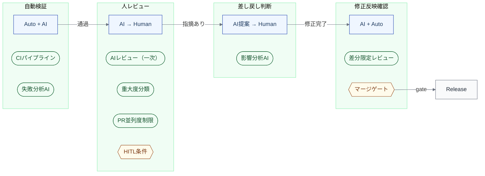
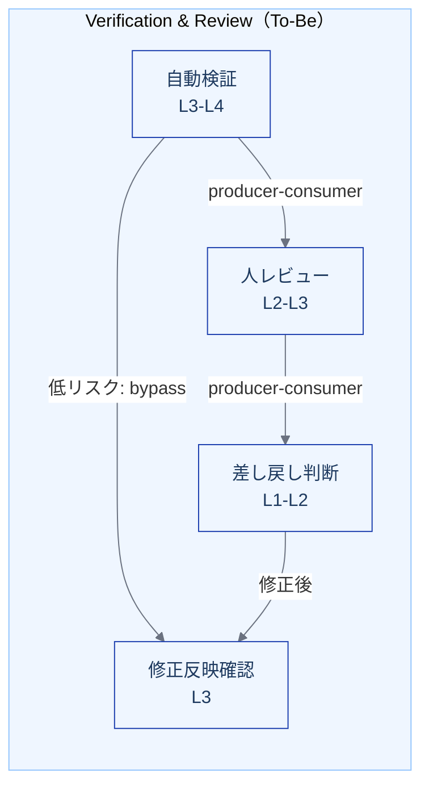

import { Aside } from '@astrojs/starlight/components';

## インスタンス化宣言

| 項目 | 値 |
|---|---|
| **対象** | Verification & Review（L1）— 自動検証 / 人レビュー / 差し戻し判断 / 修正反映確認 の各L2 |
| **モード** | 変換（As-Is → To-Be の差分設計） |
| **コンテキスト** | Webアプリケーション開発チーム（5〜15名）、CI/CD整備済み、[Implementation のAI導入](/instances/implementation/)が進行中 |
| **埋めるビュー** | 実行設計ビュー、制御環境ビュー、As-Is/To-Beビュー、依存関係（補足） |
| **前提インスタンス** | [Implementation: 変換モード](/instances/implementation/) — 本インスタンスはその後工程として、ボトルネック移動の受け手を設計する |

## なぜ Verification & Review を次に扱うか

[Implementation の変換設計](/instances/implementation/)は実装リードタイムを大幅に短縮する。その結果、PR生成速度がレビュー消化速度を上回り、**ボトルネックが Verification & Review へ移動する**。これは[ボトルネック移動パターン1](/dynamics/bottleneck-patterns/#パターン1-implementation--verification-移動)の典型例である。

したがって、Implementation の変換設計を完結させるには、受け手である Verification & Review の変換設計が不可欠である。

## 1. 実行設計ビュー: As-Is → To-Be

### As-Is（AI導入前の典型）

人間がすべての検証・レビュー・差し戻し判断を担う。

| L2 | R（実行） | A（責任） | 裁量レベル | 協調様式 |
|---|---|---|---|---|
| 自動検証 | Automation（CI） | Human（担当者） | — | 自動実行（設定は人間が管理） |
| 人レビュー | Human（レビュアー） | Human（レビュアー） | — | 非同期（PRコメント） |
| 差し戻し判断 | Human（レビュアー） | Human（レビュアー） | — | 対話（コメントまたは口頭） |
| 修正反映確認 | Human（レビュアー） | Human（レビュアー） | — | 非同期（再レビュー） |

### To-Be（AIエージェント前提）

AIが一次検証と一次レビューを担い、人間は高リスク判断に集中する。

| L2 | R（実行） | A（責任） | 裁量レベル | 協調様式 |
|---|---|---|---|---|
| 自動検証 | Automation + AI Agent | Human（担当者） | L3〜L4 | 自律（失敗分析・自動修正を含む） |
| 人レビュー | AI Agent → Human | Human（レビュアー） | L2〜L3 | 段階的委譲（AIフィルタ → 人間深読み） |
| 差し戻し判断 | AI Agent（提案）→ Human（決定） | Human（レビュアー） | L1〜L2 | 人間主導（AI提案を参考） |
| 修正反映確認 | AI Agent + Automation | Human（レビュアー） | L3 | 委譲（差分に限定した自動確認） |

### 差分の設計判断

| L2 | 何が変わるか | なぜ変えるか |
|---|---|---|
| 自動検証 | CIの結果判定にAIが加わり、失敗分析と修正提案を自動実行する（一定回数失敗でエスカレーション） | CI失敗→人間が分析→修正依頼のループが遅い |
| 人レビュー | AIが一次レビューを行い、人間は高リスク指摘と設計判断に集中する | PR流入量の増加により、全件を同じ深さで読むことが不可能に |
| 差し戻し判断 | AIが影響分析と差し戻し先の提案を行い、人間が最終判断する | 差し戻し先の判断は暗黙知に依存しやすく、誤判断は手戻りを増やす |
| 修正反映確認 | AIが修正差分を対象に自動再検証し、人間は差分のみの承認に限定する | 全体再レビューは非効率 |

<Aside type="tip">
差し戻し判断の裁量レベルが L1〜L2 に留まっていることに注意。検証の移譲は実行の移譲より遅れて進む。特に「どこに戻すか」の最終判断は、移譲が最も難しい領域である。
</Aside>

## 2. 制御環境ビュー: To-Be

Implementation では「AIの実行を制御する」ことが主題だったが、Verification & Review では「AIと人間の**判断の分担**を制御する」ことが主題になる。

### 自動検証

| 制御の種類 | 主体 | 内容 |
|---|---|---|
| CIパイプライン | Automation | lint → typecheck → unit test → integration test → SAST の自動実行 |
| 失敗分析AI | AI Agent | テスト失敗ログの構造化分析と修正提案 |
| 自動修正の制約 | ポリシー | AIの自動修正はテスト・lint修正に限定。ビジネスロジックの変更は禁止 |

### 人レビュー

| 制御の種類 | 主体 | 内容 |
|---|---|---|
| AIレビュー（一次） | AI Agent | セキュリティ、パフォーマンス、ベストプラクティスの自動チェック |
| 指摘の重大度分類 | AI Agent | CRITICAL / HIGH / MEDIUM / LOW に分類し、人間の注意を誘導 |
| PRサイズゲート | Automation | 800行超のPRを警告/ブロックし、分割を促す |
| PR並列度制限 | Automation | オープンPR数の上限管理（推奨: 同時3件以下） |
| HITL条件 | ポリシー | セキュリティ / 権限 / DB変更 / API互換性破壊は必ず人間が承認 |

### 差し戻し判断

| 制御の種類 | 主体 | 内容 |
|---|---|---|
| 影響分析AI | AI Agent | 指摘内容から影響範囲と差し戻し先を推定・提案 |
| 差し戻し先の分類基準 | ポリシー | Implementation / Design / Specification の3分類を定義 |
| 差し戻し理由の構造化 | AI Agent | テンプレートに沿って構造化記録 |

### 修正反映確認

| 制御の種類 | 主体 | 内容 |
|---|---|---|
| 差分限定レビュー | AI Agent | 修正前後のdiff差分のみを対象に検証 |
| 承認条件の自動チェック | Automation | 全指摘が対応済みであることの確認 |
| マージゲート | Automation | 全条件通過をマージ条件とする |

### 制御の全体像

## 3. As-Is / To-Be 比較

### 仕事の重心の移動

| 移動元 | 移動先 |
|---|---|
| PRを全行読む | 高リスク指摘に集中する（AIが低リスク指摘をフィルタ） |
| CI失敗を分析して修正依頼する | CI失敗の自動修正を監視する |
| 差し戻し先を暗黙知で決める | 差し戻しポリシーを設計・維持する |
| 修正後に全体を再レビューする | 承認条件の設計と例外処理 |

Implementation では「コードを書く → 意図と制約を明示する」への移動だった。Verification & Review では「コードを読んで判断する → **判断基準と分類ポリシーを設計する**」への移動である。

### ボトルネック移動への構造的対処

Implementation の高速化によるボトルネック移動に、以下のレベルで対処する。

| レベル | アプローチ | 具体的な制御 |
|---|---|---|
| **1. 流入量の制御**（Supply側） | Implementationの出力ペースを調整 | PR並列度制限（同時3件以下）、PRサイズゲート（800行超でブロック） |
| **2. 処理能力の拡張**（Demand側） | Verificationの処理速度を上げる | AIレビュー（一次）、Changelog要約、差分限定レビュー |
| **3. 判断の自動化**（Bypass） | 一部のPRを人間レビューなしで通す | 低リスク変更の自動マージ、HITL条件に該当しないPRの承認自動化 |

<Aside type="caution">
レベル3（Bypass）は最もリスクが高い。自動マージ条件の緩和しすぎはリリース後のロールバック率を悪化させる。段階的に導入し、ロールバック率を最重要の警告信号として監視する。
</Aside>

### 裁量レベルの段階的引き上げ

検証の移譲（D3）は実行の移譲（D2）より遅れて進む。

| 段階 | 自動検証 | 人レビュー | 差し戻し判断 | 修正反映確認 |
|---|---|---|---|---|
| **D0 委譲なし** | CIのみ | 人間が全件レビュー | 人間の暗黙知 | 人間が全体再レビュー |
| **D1 判定あり** | CI成功/失敗の自動判定 | 人間が全件レビュー | 人間が判断 | 人間が確認 |
| **D2 次アクション定義** | CI失敗時の再実行/通知の自動化 | AIレビュー導入（ノンブロッキング） | AI提案、人間が決定 | AI差分確認 + 人間承認 |
| **D3 品質評価自動化** | AI失敗分析・自動修正 | 重大度分類、低リスク自動マージ | AI影響分析、人間は例外のみ | AI自動確認、例外のみ人間 |
| **D4 改善ループ** | 完全自動化 | 品質監査（抜き打ち） | 自動化 + 監査 | 完全自動化 |

## 4. 依存関係

### To-Be のL2間依存

AIの介入により、自動検証から低リスクPRが人レビューをbypassするパスが生まれる。

## 5. Validation の観点

| 指標 | 期待する変化 | 悪化の警告信号 |
|---|---|---|
| 初回レビュー時間 | 短縮（AIレビューの即時性） | 長期化はAIレビューの障害 |
| マージまでの時間 | 短縮（低リスク自動マージ） | 長期化はPRキューの詰まり |
| レビュー指摘密度 | 維持または向上 | 低下はAI過信によるレビュー手抜き |
| AIレビュー受け入れ率 | 向上 | 低下はAI指摘の品質低下 |
| 差し戻し率 | 維持または改善 | 悪化はImplementation側の品質低下 |
| 自動マージ率 | 段階的に向上 | 急上昇は条件の緩和しすぎ |
| **ロールバック率** | 維持または改善 | **悪化は自動マージ条件の不備（最重要の警告信号）** |

## Implementation インスタンスとの接続

| 接続点 | 内容 |
|---|---|
| **ボトルネック移動の因果** | Implementation 高速化 → PR流入量増加 → レビュー待ちキュー増加 → 本インスタンスの制御環境が必要に |
| **制御の連続性** | Implementation の提出ゲート → Verification の自動検証。ローカルとCIの環境差異が問題になりうる |
| **裁量レベルの非対称性** | Implementation（D2）の引き上げが先行し、Verification（D3）は遅れて追随する |

## このインスタンスの限界

- **コンテキスト固定** — Webアプリ5〜15名チームを想定。大規模組織や規制産業には追加の制御が必要
- **D3 Level 2〜3相当** — 完全自動化（Level 4-5）への拡張は別途設計が必要
- **ツール選定はスコープ外** — 特定のAIレビューツールの選定は本インスタンスの範囲外
- **Release への接続は未着手** — Verification → Release のボトルネック移動（[パターン2](/dynamics/bottleneck-patterns/#パターン2-verification--release-移動)）への対処は今後の課題
