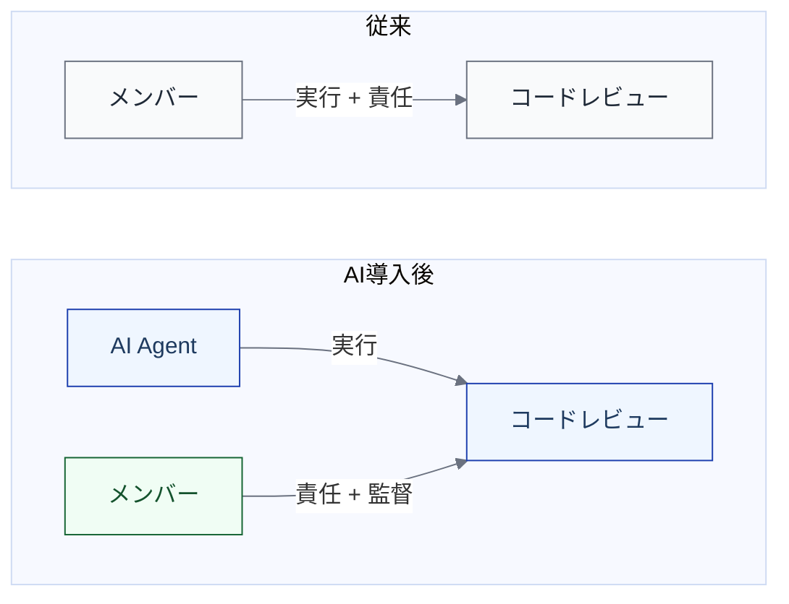

import { Aside } from '@astrojs/starlight/components';

## AIエージェント時代の問い

AIエージェントがコードを書き、テストを実行し、PRを作成する。この変化はすでに起きている。しかし、多くのチームが直面しているのは「どのツールを使うか」ではなく、もっと根本的な問いである。

- 仕事の流れのどこにAIを入れるのか
- どこまでの裁量を委ね、どこに人の判断を残すのか
- 安全に回すために何を設計しておくべきか
- AI導入前後で何が変わり、何が変わらないのか

これらの問いに答えるには、「ツールの機能比較」でも「AIに全部任せる/任せない」の二択でもなく、**誰が何をどこまで担うかをワークフロー全体で設計するための枠組み**が必要になる。

## 仕事の流れを整理する枠組みは、すでに豊富にある

仕事の流れを回す・捉える・改善するための枠組みは、すでに多数存在する。それらは目的ごとに使い分けるものであり、実務では複数を組み合わせて使うのが当たり前である。

**汎用の枠組み** — 業界を問わず使えるもの。

| 目的 | 代表例 | 何をするか |
|---|---|---|
| 改善を回す | PDCA, OODA, DMAIC | 計画→検証の反復、高速な判断 |
| 流れを図にする | フローチャート, BPMN | 手順・分岐・担当の可視化 |
| 全体を俯瞰する | SIPOC, Value Stream Mapping | 入出力の整理、ボトルネックの特定 |
| 役割を明確にする | RACI | 実行・承認・相談・共有の割当 |
| 作業を分解・管理する | WBS, ガントチャート, カンバン | タスク分解、スケジュール、進捗管理 |

**エンジニアリング特化の枠組み** — ソフトウェア開発の「どう進めるか」に踏み込むもの。

| 目的 | 代表例 | 何をするか |
|---|---|---|
| 開発全体の段階を定義する | SDLC, ISO/IEC/IEEE 12207 | ライフサイクルの共通語彙と標準化 |
| チームの進め方を決める | Scrum, Kanban | 反復・フロー管理 |
| 開発→運用を繋ぐ | DevOps, CI/CD | 連続的なデリバリーの自動化 |
| デリバリーの健全性を測る | DORA, SPACE | 速度・安定性・開発者体験の定量評価 |
| チーム構造を設計する | Team Topologies | 認知負荷とフローの関係 |

実務ではこれらを組み合わせて使う。たとえば「SIPOC で全体像を掴み → フローチャートで手順を描き → RACI で役割を決め → カンバンで進捗を管理し → PDCA で改善を回す」といった具合である。

## AIエージェントによって変わること

具体的な場面で考えてみる。あるチームでは、コードレビューをチームメンバーに依頼していた。依頼された人がコードを読み、問題を指摘し、承認する。このとき「レビューを実行する人」と「レビューの質に責任を持つ人」は同一だった。わざわざ分けて考える必要はなかった。

ここにAIエージェントが入るとどうなるか。AIがコードを読み、問題を指摘し、修正案まで出す。しかし、そのレビュー結果の妥当性に責任を持てるのは、依然として人である。**実行する主体と、責任を持つ主体が分離する。**

この分離は、コードレビューに限った話ではない。実装、テスト、デプロイ——AIエージェントが参加するあらゆる段階で、同じ構造的な変化が起きる。

さらに、AIへの委ね方も一律ではない。「AIが下書きして人が仕上げる」場合もあれば、「AIが自律的に完了し、人は結果だけ確認する」場合もある。「任せる/任せない」の二択ではなく、**どこまでの裁量を委ねるかを段階的に設計する**必要がある。

## ワークフローに組み込むために必要になること

この2つの変化——実行と責任の分離、裁量の段階的な委譲——をワークフローの中で扱うには、既存の枠組みに対していくつかの問いを加える必要がある。

まず、**仕事の分解の粒度**が変わる。人に「この機能を実装して」と頼めば、経験や文脈を踏まえて適切に進めてくれる。しかしAIに委譲するなら、何をどこまでやるか、どんな制約があるかを明示できる単位まで仕事を分解しなければならない。

次に、**各段階で何を決めておくべきか**が増える。誰が実行するのか、どんな条件を満たせば次に進めるのか、何を受け渡すのか——人だけで回していたときは暗黙のうちに決まっていたことを、明示的に設計する必要がある。

そして、**どう見えるようにするか**も問われる。仕事の流れ、安全を支える仕組み、成果の評価を別々に見るだけでは、AIが関わるワークフローの全体像は掴みにくい。複数の観点を統合的に可視化する手段が必要になる。

本モデルの目的は、**既存の知見をAIエージェントを前提とした枠組みとして体系化する**ことである。ゼロから新しい枠組みを発明するのではなく、すでに実績のある知見を、AIエージェントがもたらす変化に対応できる形で整理・統合する。

具体的にどう体系化したかは、[モデルの全体像](/introduction/model-overview/)で説明する。
