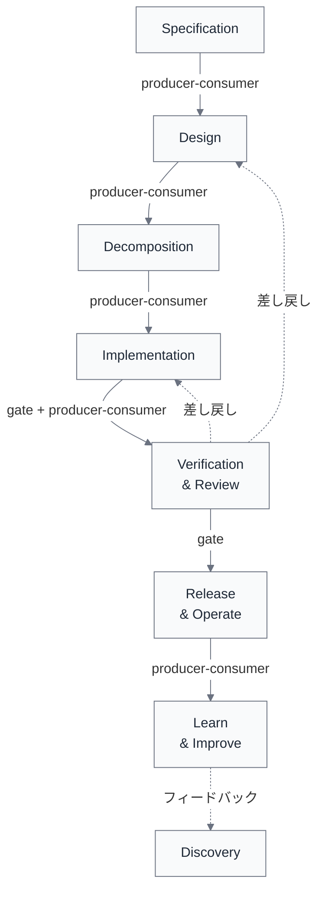

import { Aside } from '@astrojs/starlight/components';

## なぜ依存関係を明示するのか

ライフサイクルの各段階を個別に定義しただけでは、段階間の「つなぎ」が見えない。実際のソフトウェア開発では、前工程の出力が後工程の入力になり、承認が次の開始条件になり、並行作業がリソースを共有する。これらの依存関係を暗黙のまま放置すると、手戻り、待ち、コンフリクトの原因になる。

依存関係を明示する目的は以下の3つである。

1. **ボトルネックの発見** — どこで待ちが発生するかを事前に把握する
2. **差し戻し先の特定** — 問題が起きたとき、どこまで戻るべきかを判断する根拠にする
3. **並行化の設計** — どのステップを並行に進められるかを判断する

<Aside>
依存関係はL2単体の属性ではなく、L2間の関係である。そのため、L2定義表（[L2分解表](/lifecycle/l2-decomposition/)）の列に押し込まず、別に管理する。
</Aside>

## 依存関係の型

依存関係は以下の型に分類される。

| 型 | 意味 | 例 |
|---|---|---|
| **producer-consumer** | fromの出力がtoの入力になる | Specification → Design |
| **gate** | fromの完了がtoの開始条件になる | リリース判断 → デプロイ |
| **shared-resource** | fromとtoが同じリソースを使う | 並行Implementation間の同一モジュール |
| **synchronization** | fromとtoが同期点を持つ | DesignとDecompositionの整合確認 |

<Aside type="tip">
最も頻度が高いのは **producer-consumer** 型であり、これはステップ間の入出力を追えば特定できる。**gate** 型は承認ゲートや品質ゲートに対応する。**shared-resource** と **synchronization** は並行作業時に特に重要になる。
</Aside>

## 依存関係の全体像

以下の図は、高優先L1（Specification〜Learn & Improve）間の主要な依存関係の流れを示す。Discovery と Framing は粗め扱いのため省略しているが、Learn & Improve から Discovery へのフィードバックループは記載している。実線は順方向の依存（producer-consumer / gate）、破線はフィードバックループ（逆方向の依存）を表す。

## 依存関係表

以下は高優先L1を中心とした主要な依存関係の整理である。網羅ではなく、設計判断に影響する依存を優先して記載する。

### Specification → Design

| 依存元 | 依存先 | 型 | 条件 | 備考 |
|---|---|---|---|---|
| Specification.受け入れ条件の定義 | Design.方式選定 | producer-consumer | 受け入れ条件が明文化されている | 不明確なら差し戻し |
| Specification.非機能要求の整理 | Design.方式選定 | producer-consumer | 性能・安全の制約が定義されている | 非機能が曖昧だと方式選定が発散 |
| Specification.制約・前提の明文化 | Design.責務・境界設計 | producer-consumer | 外部依存・制約が文書化されている | — |

### Design → Decomposition

| 依存元 | 依存先 | 型 | 条件 | 備考 |
|---|---|---|---|---|
| Design.責務・境界設計 | Decomposition.変更単位の分解 | producer-consumer | 境界が定義されている | 境界未定だと分解が不安定 |
| Design.実装・検証方針の設計 | Decomposition.実行順序の整理 | producer-consumer | 実装方針がある | — |

### Decomposition → Implementation

| 依存元 | 依存先 | 型 | 条件 | 備考 |
|---|---|---|---|---|
| Decomposition.実行計画の作成 | Implementation.文脈収集 | producer-consumer | 対象タスクが選ばれている | — |
| Decomposition.依存関係の特定 | Implementation.変更実装 | producer-consumer | 待ち条件が明示されている | 未特定だと並行実装で競合 |

### Implementation → Verification & Review

| 依存元 | 依存先 | 型 | 条件 | 備考 |
|---|---|---|---|---|
| Implementation.ローカル整合確認 | Verification.自動検証 | gate | ローカルCIが通過している | ローカル未通過で提出するとCI失敗が増える |
| Implementation.テスト作成・更新 | Verification.自動検証 | producer-consumer | テストが追加されている | テストなしだと自動検証の網が粗くなる |

### Verification & Review → Release & Operate

| 依存元 | 依存先 | 型 | 条件 | 備考 |
|---|---|---|---|---|
| Verification.修正反映確認 | Release.統合準備 | gate | 承認状態である | — |
| Verification.自動検証 | Release.デプロイ・反映 | gate | CI全通過 | テスト通過がデプロイの前提 |

### Release & Operate → Learn & Improve

| 依存元 | 依存先 | 型 | 条件 | 備考 |
|---|---|---|---|---|
| Release.監視・運用・初動復旧 | Learn.結果計測 | producer-consumer | 運用データが蓄積されている | — |

### フィードバックループ（逆方向の依存）

順方向だけでなく、逆方向にも重要な依存が存在する。これらはライフサイクルの改善サイクルを形成する。

| 依存元 | 依存先 | 型 | 条件 | 備考 |
|---|---|---|---|---|
| Verification.差し戻し判断 | Implementation.変更実装 | producer-consumer | 修正方針が決まっている | 最も頻度の高い差し戻し |
| Verification.差し戻し判断 | Design.責務・境界設計 | producer-consumer | 設計レベルの問題が検出された | 頻度は低いが影響大 |
| Learn.仕組み改善への反映 | Discovery.課題・機会の収集 | producer-consumer | 改善テーマが出ている | 長期フィードバックループ |

<Aside type="caution">
差し戻しの中で最も頻度が高いのは Verification → Implementation への差し戻しである。一方、Verification → Design への差し戻しは頻度は低いが、発生時の影響が大きい。差し戻し先の分布を測定することで、どの段階の品質に問題があるかを把握できる。
</Aside>

## 今後の拡充

現在の依存関係表は初版であり、以下の拡充を予定している。

- **shared-resource型の依存** — 並行Implementation間のコンフリクト等
- **L1をまたぐsynchronization** — DesignとDecompositionの並行進行時の整合ポイント
- **粗め扱いL1の依存関係** — Discovery、Framing、Learn & Improveの依存関係追加
