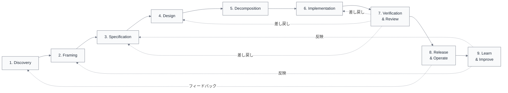

import { Aside } from '@astrojs/starlight/components';

## なぜライフサイクルを背骨に置くのか

AIエージェントをソフトウェア開発に導入するとき、最初に必要になるのは「どこに入れるか」を示す地図である。ライフサイクルはその地図の役割を果たす。

ライフサイクルを基準に置く理由は4つある。

- **時間軸の共有** — 仕事の流れを関係者全員が同じ粒度で話せる
- **既存プロセスとの接続** — SDLC、PDLC、DevOps といった既存の枠組みと対応づけやすい
- **AIの介入点の可視化** — どの段階にAIが入り込むかを示しやすい
- **後続ビューの基準面** — 実行設計、制御環境、測定といったビューを載せる共通の下敷きになる

<Aside type="caution">
このライフサイクルは「唯一の正しい工程表」ではなく、比較・設計・改善のための参照モデルである。組織構造、プロダクト特性、規制、運用負荷によって、工程の追加・統合・再分割は当然発生する。
</Aside>

## 9段階の一覧

| # | 段階 | 目的 | 主なアウトプット |
|---|---|---|---|
| 1 | Discovery | 課題・機会・制約を観測する | 課題候補リスト、現状整理メモ |
| 2 | Framing | 何を問題として扱うかを決める | 問題定義、成功条件、スコープ定義 |
| 3 | Specification | 要件・受け入れ条件・制約を明文化する | 要求一覧、AC、非機能要求一覧 |
| 4 | Design | 構造・責務・境界・インターフェースに落とす | 方式比較、境界定義、API契約、テスト方針 |
| 5 | Decomposition | 実行可能なタスクや変更単位に分解する | タスク一覧、実行順序、依存関係表 |
| 6 | Implementation | 実装・設定変更・テスト作成を進める | 変更コード、テストコード、ローカル検証結果 |
| 7 | Verification & Review | テスト・レビュー・評価・差し戻しを行う | CI結果、レビュー判断、修正方針 |
| 8 | Release & Operate | 統合・リリース・監視・運用・復旧を行う | デプロイ記録、運用記録、障害記録 |
| 9 | Learn & Improve | フィードバックを集め、改善に反映する | 計測結果、Postmortem、playbook更新 |

## 全体の流れ

<Aside>
ライフサイクルは直線ではない。Verification からの差し戻し、Release から Discovery へのフィードバック、Learn から Framing/Specification への反映といったループが常に存在する。
</Aside>

## 各段階の概要

### 1. Discovery

課題、機会、制約を捉える段階である。顧客、現場、事業、システムの変化を把握し、後続の Framing に渡せる材料を集める。まだ「何を作るか」は決めていない。

### 2. Framing

Discovery で得た材料をもとに、何を問題として扱うかを決める段階である。目的、成功条件、優先順位、境界を定め、チームが同じ方向を向けるようにする。

### 3. Specification

Framing の結果を、実装や検証に耐える「明文化された要求」へ落とす段階である。要件、受け入れ条件、制約、非機能要求を文書化する。ここで曖昧さを残すと、後続の全段階に手戻りが波及する。

### 4. Design

Specification で定めた要求を、構造、責務、境界、インターフェースに変換する段階である。方式選定、責務・境界設計、インターフェース設計、実装・検証方針の設計を含む。

### 5. Decomposition

Design を、実行可能な変更単位やタスクへ分解する段階である。変更単位の分解、実行順序の整理、依存関係の特定、実行計画の作成を行い、Implementation に渡せる状態にする。

### 6. Implementation

Decomposition で定めた変更単位に沿って、実際に変更を加える段階である。文脈収集、変更実装、テスト作成・更新、ローカル整合確認を経て、次工程へ出せる最低品質まで持っていく。

### 7. Verification & Review

Implementation の成果が、要求・設計・品質条件に照らして妥当かを検証する段階である。自動検証（CI）、人レビュー、差し戻し判断、修正反映確認を含む。差し戻し先の判断も重要な活動である。

### 8. Release & Operate

検証済みの変更を本番に反映し、運用上安全に維持する段階である。統合準備、リリース判断（Go/No-Go）、デプロイ・反映、監視・運用・初動復旧を含む。

### 9. Learn & Improve

結果・障害・手戻り・待ち時間を振り返り、次のサイクルへ改善を埋め込む段階である。結果計測、問題分析、ナレッジ化、仕組み改善への反映を行う。ここでの成果は Discovery や Framing に戻り、長期フィードバックループを形成する。

## 粒度の考え方

ライフサイクルは1つの粒度だけでは足りない。本モデルでは4つのレイヤーを定義している。

| レイヤー | 名称 | 説明 | 例 |
|---|---|---|---|
| L0 | 価値創出の大ループ | 最も粗い5段階の流れ | 課題を捉える → 何を作るか決める → 作る → 出す → 学ぶ |
| L1 | 標準ライフサイクル | 上記の9段階 | Discovery, Framing, ... |
| L2 | 各段階の詳細ステップ | L1を詳細化したもの | Specificationの場合: 要求整理、制約整理、受け入れ条件（AC）定義、非機能整理 |
| L3 | タスクテンプレート | Issue単位のミクロループ | 依頼受領 → 文脈収集 → 方針決定 → 実装 → 検証 → レビュー → ... |

L2の詳細は[L2分解表](/lifecycle/l2-decomposition/)を参照。

## 主要なループ構造

ライフサイクルは直線的に進むだけではない。以下の3種類のループが存在する。

**差し戻しループ** — Verification & Review から Specification、Design、Implementation への差し戻し。品質を担保する短期ループである。

**運用フィードバックループ** — Release & Operate から Discovery へのフィードバック。本番運用で得た知見が新たな課題発見につながる。

**長期フィードバックループ** — Learn & Improve から Framing、Specification への反映。事故学習、playbook更新、制御環境の改善を含む長期の改善サイクルである。

<Aside type="tip">
ライフサイクルを詳細化しすぎると、ステップ間の接続不良や依存関係の問題を見失う。重要なのは、各ステップの中身だけでなく、ステップ間の受け渡し条件、差し戻し条件、観測点をセットで見ることである。
</Aside>

## model/ との対応

このページの内容は、以下のモデルファイルに基づいている。

| モデルファイル | 対応する内容 |
|---|---|
| `model/04_lifecycle.md` | 9段階の定義、粒度の考え方、ループ構造 |
| `model/04a_lifecycle_l2_table.md` | L2分解（詳細は[L2分解表](/lifecycle/l2-decomposition/)） |
| `model/04d_dependency_map.md` | 依存関係（詳細は[依存関係マップ](/lifecycle/dependency-map/)） |
