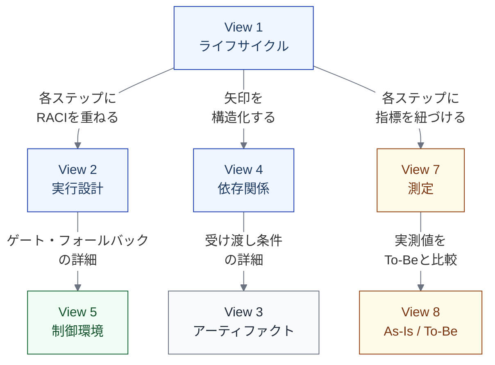

import { Aside } from '@astrojs/starlight/components';

## なぜつなぎ方が必要か

8つのビューは独立して使えるが、統合モデルとして機能するにはビュー間の**参照関係**が必要になる。ビューを独立に書くだけでは、同じステップの実行設計と制御環境が矛盾したり、依存関係と測定指標が対応しなかったりする。

つなぎ方を定義することで、ビュー間の整合性を保ちながら、必要なビューだけを選んで使えるようになる。

## 共通のID体系

ビュー間を参照するための共通語彙として、以下のID体系を使う。

### ステップID

ステップは `L1名.L2名` で一意に参照する。

| ID例 | 意味 |
|---|---|
| `Implementation.変更実装` | Implementation の L2「変更実装」 |
| `Verification.CI実行` | Verification & Review の L2「CI実行」 |
| `Release.リリース判断` | Release の L2「リリース判断」 |

L1 レベルで参照する場合は `Implementation`、`Verification` のように L1 名のみを使う。

### IDの使い方

| ビュー | IDの使い方 |
|---|---|
| [依存関係ビュー](/views/view-4-dependency/) | from / to にステップIDを使う |
| [測定ビュー](/views/view-7-measurement/) | observation_point にステップIDを使う |
| [実行設計ビュー](/views/view-2-execution/) | 各行のステップをIDで識別する |
| [制御環境ビュー](/views/view-5-control/) | 制御が掛かるステップをIDで識別する |

## ビュー間の参照方向

ビュー間には一方向の参照関係がある。以下の図は「どのビューがどのビューを参照するか」を示す。

### 参照関係の一覧

| 基盤ビュー | 参照するビュー | 参照内容 |
|---|---|---|
| ライフサイクルビュー | → 実行設計ビュー | 各ステップに RACI を重ねる |
| ライフサイクルビュー | → 依存関係ビュー | ステップ間の矢印を構造化する |
| ライフサイクルビュー | → 測定ビュー | 各ステップに指標を紐づける |
| 実行設計ビュー | → 制御環境ビュー | ゲート・フォールバックの詳細を参照する |
| 依存関係ビュー | → アーティファクトビュー | 受け渡し条件の詳細を参照する |
| 測定ビュー | → As-Is / To-Be ビュー | 実測値を To-Be との比較に使う |

## 統合の実践

### ステップ1: ライフサイクルビューから始める

[ライフサイクルビュー](/views/view-1-lifecycle/)は全ビューの背骨である。まず L1 9段階を定義し、必要に応じて L2 に分解する。

### ステップ2: 実行設計と依存関係を重ねる

ライフサイクルの各ステップに、[実行設計ビュー](/views/view-2-execution/)で RACI と裁量レベルを重ね、[依存関係ビュー](/views/view-4-dependency/)でステップ間の関係を構造化する。

### ステップ3: 必要なビューを追加する

AI導入の対象ステップについて、[制御環境ビュー](/views/view-5-control/)と[測定ビュー](/views/view-7-measurement/)を追加する。効果検証が必要な場合は[As-Is / To-Be ビュー](/views/view-8-asis-tobe/)も追加する。

<Aside type="tip">
すべてのビューを同時に作る必要はない。ライフサイクル → 実行設計 → 依存関係の順に基盤を固め、必要に応じて他のビューを追加するのが実践的である。
</Aside>

## 整合性の確認

ビューを増やすほど、ビュー間の整合性の確認が重要になる。以下のチェックを行う。

| チェック項目 | 確認内容 |
|---|---|
| ステップIDの一致 | 全ビューで同じステップIDを使っているか |
| 依存とアーティファクトの整合 | 依存関係ビューの Producer-Consumer とアーティファクトビューの生成元・消費先が一致するか |
| 実行設計と制御環境の整合 | 実行設計ビューのゲート・フォールバックが制御環境ビューに記述されているか |
| 測定と As-Is / To-Be の整合 | 測定ビューの指標が As-Is / To-Be ビューの記述項目に含まれているか |
