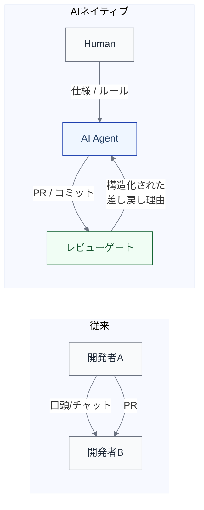

import { Aside } from '@astrojs/starlight/components';

## 目的

仕事が**何を介して流れるか**を表す。主体間の直接対話ではなく、成果物（Artifact）を介した受け渡しの構造を明らかにする。

## メタ定義

| メタ項目 | 定義 |
|---|---|
| **目的** | 仕事が何を介して流れるかを表す。成果物を介した受け渡しの構造を明らかにする |
| **主語** | アーティファクト（成果物） |
| **最小記述単位** | アーティファクト単位（どのL2が生成し、どのL2が消費するか） |
| **記述項目** | アーティファクト名、生成元L2、消費先L2、受け渡し条件、差し戻し条件、形式（文書 / コード / データ / 設定） |
| **停止基準** | 主要なアーティファクトについて生成元・消費先・受け渡し条件が定義されていれば十分。全中間成果物を列挙する必要はない |
| **ライフサイクルとの対応** | L2の入出力アーティファクト列から抽出して構成する |
| **いつ使うか** | 受け渡しの品質問題が起きたとき、非同期協業の設計時 |

## なぜアーティファクトに注目するか

AIネイティブな協業は、主体間の直接対話よりも**アーティファクトを介した非同期受け渡し**として起きやすい。

従来は口頭やチャットで伝えていた意図を、AIとの協業ではアーティファクト（仕様書、ルールファイル、構造化されたレビューコメント等）として明示する必要がある。

## 主要なアーティファクトの例

| アーティファクト | 生成元 | 消費先 | 形式 |
|---|---|---|---|
| 問題定義書 | Framing | Specification | 文書 |
| 要件定義 / ユーザーストーリー | Specification | Design | 文書 |
| 設計書 / ADR | Design | Implementation | 文書 |
| タスク分解表 | Decomposition & Planning | Implementation | 文書 / データ |
| ソースコード（差分） | Implementation | Verification & Review | コード |
| テストコード | Implementation | Verification & Review | コード |
| レビューコメント / 差し戻し理由 | Verification & Review | Implementation | 文書 |
| デプロイパッケージ | Release | Monitoring & Ops | コード / 設定 |
| 運用レポート / インシデント記録 | Monitoring & Ops | Learn | データ / 文書 |

## AIネイティブ文脈での重要性

[Mediator ファセット](/execution/ai-four-facets/#mediator媒介者)が示すように、AIはアーティファクトの生成・消費パターンそのものを変える。

| 変化 | 影響 |
|---|---|
| AI生成PRの粒度が均一になりやすい | レビュー方式を変える必要がある |
| AI生成コードに自然言語の設計意図が希薄 | コメントやADRの重要性が上がる |
| 差し戻し理由が構造化されると修正が容易になる | Evaluator による構造化が価値を持つ |
| ルールファイルがアーティファクトとして機能する | CLAUDE.md や .cursorrules が制御環境の一部になる |

<Aside type="caution">
AI生成アーティファクトと人間が書くアーティファクトの品質差を無視すると、後工程（レビュー、テスト）の設計が現実とずれる。このビューで生成パターンの変化を意識的に捉えることが重要である。
</Aside>

## model/ との対応

このページの内容は以下のモデルファイルに基づいている。

| セクション | 対応ファイル | 対応箇所 |
|---|---|---|
| メタ定義 | `model/06_views.md` | 「View 3: アーティファクト＆受け渡しビュー」セクション |
| Mediator との関連 | `model/05a_ai_multifaceted_nature.md` | 「Mediator（媒介者）」セクション |
| アーティファクトの基底要素 | `model/03_core_model.md` | 「Artifact（媒介物）」セクション |
