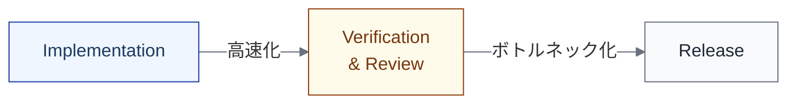

import { Aside } from '@astrojs/starlight/components';

## 目的

**どこで待ちや競合が発生するか**を示す。ステップ間の依存関係を構造化し、ボトルネックの移動を見えるようにする。

このビューは個々のステップの中身には答えない。それは実行設計ビューや制御環境ビューの役割である。

## メタ定義

| メタ項目 | 定義 |
|---|---|
| **目的** | どこで待ちや競合が発生するかを示す。ボトルネックの移動を見えるようにする |
| **主語** | ステップ間の関係（エッジ） |
| **最小記述単位** | エッジ単位（from → to） |
| **記述項目** | from、to、dependency_type、condition、notes |
| **停止基準** | 追加しても**ボトルネック理解や制御環境の設計が変わらない**なら十分。設計判断に影響する依存だけ書く |
| **ライフサイクルとの対応** | L1/L2ステップ間の関係。ライフサイクルビューの「矢印」を構造化したもの |
| **いつ使うか** | 並行実装の設計時、ボトルネック分析時、AI導入による速度変化の影響分析時 |

## 依存関係の型

| 型 | 意味 | 例 |
|---|---|---|
| **Producer-Consumer** | fromの出力がtoの入力になる | Specification → Design |
| **Gate** | fromの完了がtoの開始条件になる | リリース判断 → デプロイ |
| **Shared Resource** | fromとtoが同じリソースを使う | 並行Implementation間の同一モジュール |
| **Synchronization** | fromとtoが同期点を持つ | DesignとDecompositionの整合確認 |

## 記述例

| from | to | type | condition | notes |
|---|---|---|---|---|
| Specification.要件定義 | Design.設計判断 | producer-consumer | 要件が確定済み | — |
| Implementation.変更実装 | Verification.CI実行 | gate | コミットがpush済み | — |
| Implementation.タスクA | Implementation.タスクB | shared-resource | 同一モジュールを変更 | コンフリクトリスクあり |
| Design.設計判断 | Decomposition.タスク分解 | synchronization | 設計とタスク粒度の整合 | — |

## AIネイティブ文脈での意義

AI導入により、速くなる場所だけでなく**ボトルネックが移動する場所**を見る必要がある。

| AI導入前 | AI導入後 |
|---|---|
| Implementation が時間を占める | Implementation が高速化 |
| Verification は待ち時間が短い | Verification に待ち（レビュー疲れ）が集中する |
| Release は定期的 | PR頻度増加により Release のリズムが変わる |

<Aside type="caution">
この「ボトルネックの移動」は、[Transformer ファセット](/execution/ai-four-facets/#transformer変容者)が示す構造変化の一例である。依存関係ビューで可視化しておくことで、事前に対処設計ができる。
</Aside>

## 他のビューとの関係

| ビュー | 依存関係ビューとの関係 |
|---|---|
| [ライフサイクルビュー](/views/view-1-lifecycle/) | ライフサイクルの「矢印」を依存関係ビューが構造化する |
| [アーティファクトビュー](/views/view-3-artifact/) | Producer-Consumer の受け渡し条件の詳細を参照する |
| [測定ビュー](/views/view-7-measurement/) | 待ち時間やキュー長を測定する指標の根拠になる |
