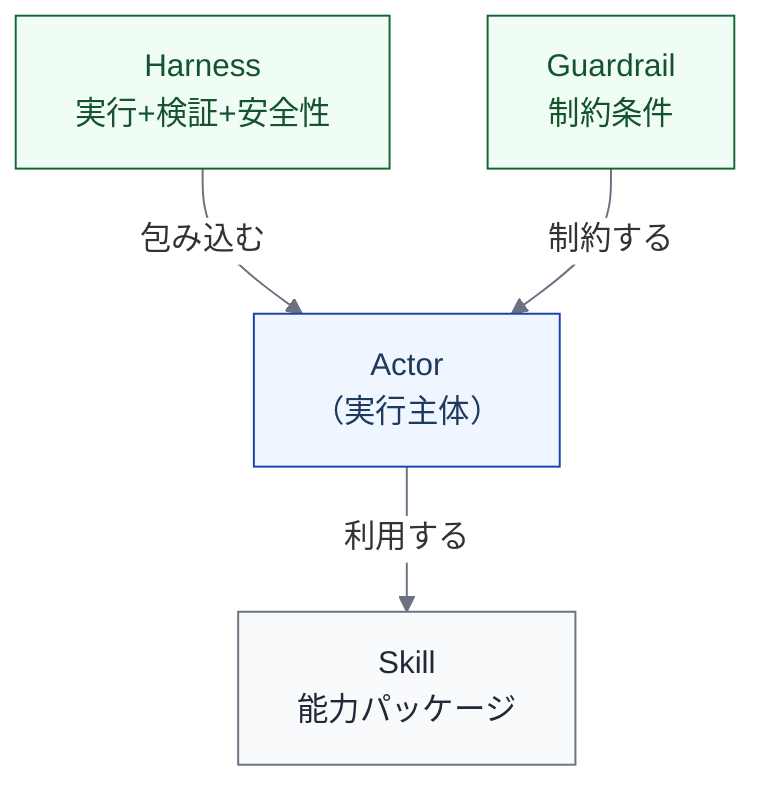

import { Aside } from '@astrojs/starlight/components';

## 目的

仕事を成立させる**制御環境**を表す。ガードレール、ハーネス、ポリシー、安全装置がどこに配置されているかを明らかにする。

## メタ定義

| メタ項目 | 定義 |
|---|---|
| **目的** | 仕事を成立させる制御環境を表す。ガードレール、ハーネス、ポリシー、安全装置の配置を明らかにする |
| **主語** | L1 / L2 ステップ |
| **最小記述単位** | L2（高優先L1）または L1（粗め扱いL1） |
| **記述項目** | 制御の種類、制御の主体（人 / ツール / ポリシー）、適用条件、例外時の振る舞い |
| **停止基準** | 各ステップの**品質ゲートと安全装置が特定されていれば十分**。制御環境の全構成要素を網羅する必要はない |
| **ライフサイクルとの対応** | L1/L2ステップごとに「どの制御が掛かるか」を記述 |
| **いつ使うか** | 安全設計時、裁量レベル引き上げ時、インシデント後の再設計時 |

## 制御の種類

制御環境ビューで記述する制御は、以下の種類に分類される。

| 制御の種類 | 説明 | 例 |
|---|---|---|
| **仕様・受け入れ基準** | 仕事の正しさを定義する基準 | spec、acceptance criteria |
| **テスト・評価** | 正しさを検証する仕組み | tests、evals、LLM-as-judge |
| **自動検証** | 機械的に合否を判定する仕組み | CI/CD、リンター、SAST |
| **権限・ポリシー** | 実行範囲を制約するルール | permission、policy、ルールファイル |
| **隔離** | 実行環境を分離する仕組み | sandbox、worktree |
| **承認ゲート** | 人の判断を挟むポイント | review gate、承認フロー |
| **観測** | 実行状態を把握する仕組み | observability、audit log |
| **復旧** | 問題発生時に戻す仕組み | rollback、incident procedure |

## Skill / Harness / Guardrail の位置づけ

制御環境を構成する要素は、以下の3つに整理できる。

| 要素 | 説明 | 例 |
|---|---|---|
| **Skill** | 主体が参照・利用する能力パッケージ | プロンプトテンプレート、MCP ツール、スキルファイル |
| **Harness** | 実行と検証と安全性を一体で成立させる制御環境 | テストフレームワーク + CI + 差分チェックの組み合わせ |
| **Guardrail** | 許可・禁止・制約条件 | CLAUDE.md のルール、.cursorrules、ブランチ保護 |

<Aside type="tip">
Skill は Actor の「手足」、Harness は Actor を「包み込む」もの、Guardrail は Actor を「制約する」もの。これらは実行主体には含めないが（[実行主体と責任主体](/execution/actor-and-responsibility/)を参照）、制御環境ビューでは中心的な記述対象になる。
</Aside>

## AIネイティブ文脈での重要性

[裁量レベル](/execution/raci-and-discretion/)を上げるほど、制御環境の設計が重要になる。

| 裁量レベル | 制御環境の設計要求 |
|---|---|
| L0〜L1（提案のみ / 人が実行） | 制御環境への要求は低い |
| L2（条件付き実行 + 人承認） | ゲート条件とフォールバックの定義が必要 |
| L3（制約内で自律実行） | ハーネス、ガードレール、観測の整備が必要 |
| L4（継続自律実行） | 包括的な制御環境の設計が不可欠 |

裁量レベルを上げることと、制御環境を整備することは**セット**で進める必要がある。制御環境なしに裁量レベルを上げることは、安全装置なしに速度を上げることに等しい。

## 記述例: Implementation の制御環境

| 制御の種類 | 制御の主体 | 適用条件 | 例外時の振る舞い |
|---|---|---|---|
| リンター自動実行 | ツール（ESLint等） | コミット時 | エラーはコミットをブロック |
| 型チェック | ツール（TypeScript等） | CI実行時 | エラーはマージをブロック |
| 差分の範囲制限 | ポリシー | AI実行時 | 範囲外の変更は差し戻し |
| テスト実行 | ツール（CI） | PR作成時 | 失敗はマージをブロック |
| 人レビュー | Human | PR作成後 | 承認なしではマージ不可 |

## model/ との対応

このページの内容は以下のモデルファイルに基づいている。

| セクション | 対応ファイル | 対応箇所 |
|---|---|---|
| メタ定義 | `model/06_views.md` | 「View 5: 制御環境ビュー」セクション |
| 制御の種類 | `model/06_views.md` | 「表現するもの」セクション |
| Skill / Harness / Guardrail | `model/06_views.md` | 「skill / harness / guardrail の位置づけ」セクション |
| 裁量レベルとの関係 | `model/05_execution_design.md` | 「裁量レベル」セクション |
