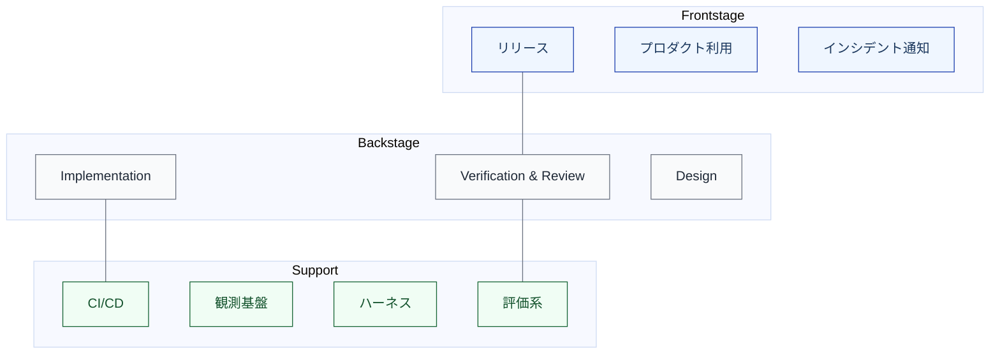

import { Aside } from '@astrojs/starlight/components';

## 目的

見える仕事と裏側の支援構造を**層として分離**する。Frontstage / Backstage / Support の区別を明確にし、裏側の基盤設計を可視化する。

## メタ定義

| メタ項目 | 定義 |
|---|---|
| **目的** | 見える仕事と裏側の支援構造を層として分離する |
| **主語** | 活動またはコンポーネント |
| **最小記述単位** | 活動単位（どのレイヤーに属するか） |
| **記述項目** | 活動名、所属レイヤー（Frontstage / Backstage / Support）、対応するL1/L2、可視性（利用者から見えるか） |
| **停止基準** | 主要な活動について**Frontstage / Backstage / Supportの配置が決まっていれば十分** |
| **ライフサイクルとの対応** | L1/L2の各活動がどのレイヤーに属するかでマッピング |
| **いつ使うか** | Service Blueprint的な分析時、裏側の支援基盤の設計時 |

## 3つのレイヤー

| レイヤー | 説明 | 例 |
|---|---|---|
| **Frontstage** | 利用者やステークホルダーから見える活動 | リリース、プロダクト利用、障害通知、進捗報告 |
| **Backstage** | 開発チーム内で完結する活動 | Implementation、Verification & Review、Design、Decomposition |
| **Support** | 観測基盤、評価系、ハーネスなどの支援構造 | CI/CD、モニタリング、ログ基盤、テストフレームワーク |

## レイヤーの分類例

| 活動 | レイヤー | 可視性 |
|---|---|---|
| Discovery（課題の発見） | Frontstage | 利用者のフィードバックとして見える |
| Framing（問題定義） | Backstage | チーム内で完結 |
| Specification（要件定義） | Backstage | チーム内で完結（ステークホルダーレビューあり） |
| Design（設計） | Backstage | チーム内で完結 |
| Implementation（実装） | Backstage | チーム内で完結 |
| Verification & Review | Backstage | チーム内で完結 |
| Release（リリース） | Frontstage | 利用者に影響する |
| Monitoring & Ops | Frontstage + Support | 障害は利用者に見える。監視基盤は裏側 |
| Learn（学習） | Backstage | チーム内で完結 |
| CI/CD パイプライン | Support | 開発チームにも利用者にも直接見えない |
| 観測基盤 | Support | 裏側の支援構造 |
| ハーネス（テスト + 検証 + 安全性） | Support | 裏側の支援構造 |

## AIネイティブ文脈での意義

AIネイティブな開発では、**Support レイヤーの重要性が増す**。

| 変化 | 理由 |
|---|---|
| ハーネスの重要性が上がる | AIの自律実行を安全に回すための制御環境が不可欠 |
| 観測基盤の重要性が上がる | AIの実行結果を事後に確認するために観測が必要 |
| 評価系の重要性が上がる | LLM-as-judge やAIレビューなどの評価インフラが必要 |
| Support と Backstage の境界が曖昧になる | AIのためのルールファイルやプロンプトは、制御環境であると同時に開発作業の一部 |

<Aside>
従来のソフトウェア開発でも CI/CD やテスト基盤は Support レイヤーに存在したが、AIネイティブ化によりこのレイヤーの設計・投資が成果を大きく左右するようになる。
</Aside>
