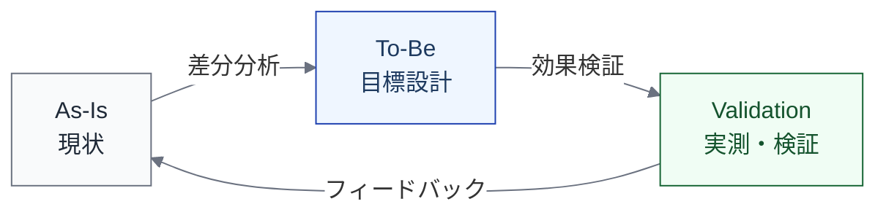

import { Aside } from '@astrojs/starlight/components';

## 目的

理想図だけで終わらせない。**現状・目標・実測**を並べて、設計と実態の差分を捉える。

## メタ定義

| メタ項目 | 定義 |
|---|---|
| **目的** | 現状・目標・実測を並べて、設計と実態の差分を捉える |
| **主語** | L1 / L2 ステップ（同一ステップを現状・目標・実測で記述） |
| **最小記述単位** | L1 または L2（比較対象の粒度に合わせる） |
| **記述項目** | As-Is（現状の実行設計・制御・指標）、To-Be（目標設計）、Validation（実測データ・ログ・検証結果） |
| **停止基準** | 主要な変更対象ステップについて**As-Is と To-Be の差分が明確になっていれば十分**。全ステップを現状・目標・実測で書く必要はない |
| **ライフサイクルとの対応** | 同一のL1/L2ステップを、現状・目標・実測の視点で記述 |
| **いつ使うか** | AI導入計画策定時、導入後の効果検証時、組織改善の振り返り時 |

## 現状・目標・実測の関係

| 面 | 記述内容 | 使い方 |
|---|---|---|
| **As-Is** | 現状の実行設計・制御環境・指標 | 「いま、どうなっているか」を記録する |
| **To-Be** | 目標とする実行設計・制御環境・指標 | 「どうしたいか」を設計する |
| **Validation** | 実測データ・ログ・検証結果 | 「実際にどうだったか」を検証する |

## 記述例: Implementation ステップ

| 項目 | As-Is | To-Be | Validation |
|---|---|---|---|
| **実行主体** | Human（開発者） | AI Agent（L2）+ Human（承認） | AI Agent が80%の変更を実装 |
| **裁量レベル** | — | L2（条件付き実行 + 人承認） | L2 で運用中。一部 L3 を試行 |
| **制御環境** | リンター + 手動テスト | リンター + CI + 自動テスト + 差分制限 | CI 自動テストを導入済み。差分制限は未導入 |
| **Lead Time** | 平均3日 | 1日以内 | 平均1.5日（改善中） |
| **Rework Rate** | 30% | 15%以下 | 22%（改善中） |

## 使い方のパターン

### パターン1: AI導入計画

1. 現状（As-Is）を記録する — 現在の実行主体、裁量レベル、制御環境、指標
2. 目標（To-Be）を設計する — AI導入後の姿
3. As-Is と To-Be の差分から、必要な制御環境の整備や指標の追加を洗い出す

### パターン2: 導入後の効果検証

1. To-Be（目標）と Validation（実測）を比較する
2. 目標に到達していない項目を特定する
3. 原因を分析し、設計を修正する

### パターン3: 継続的な改善

1. Validation を定期的に更新する
2. As-Is を現在の Validation で書き換える（新しい現状）
3. To-Be を見直し、次の改善サイクルに入る

<Aside>
現状・目標・実測すべてを埋めることが目的ではない。AI導入の変更対象ステップに絞って、差分が大きい項目を重点的に記述するのがよい。
</Aside>

## 他のビューとの関係

As-Is / To-Be ビューは、他のビューの内容を「現状・目標・実測で切る」ものである。

| 参照するビュー | As-Is / To-Be での使い方 |
|---|---|
| [実行設計ビュー](/views/view-2-execution/) | 実行主体・裁量レベルの As-Is / To-Be を記述する |
| [制御環境ビュー](/views/view-5-control/) | 制御環境の As-Is / To-Be を記述する |
| [測定ビュー](/views/view-7-measurement/) | 指標の目標値（To-Be）と実測値（Validation）を比較する |
