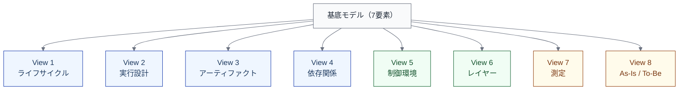

import { Aside } from '@astrojs/starlight/components';

## 単一の図では何が衝突するか

仕事の流れを1枚の図に押し込もうとすると、以下の関心事が衝突する。

| 関心事 | 問い |
|---|---|
| 時間の流れ | どの順序で進むか？ |
| 責任や実行 | 誰がどう進めるか？ |
| 受け渡し | 何を介して仕事が流れるか？ |
| 依存関係 | 何が何に依存しているか？ |
| 制御環境 | 何が安全性を担保しているか？ |
| 表/裏構造 | 利用者に見える仕事と裏側の支援構造は何か？ |
| 測定 | 何をどう測るか？ |
| 現実と理想の差分 | 設計と実態はどれだけズレているか？ |

これらを1枚の図に詰め込むと、情報過多で理解が困難になる。かといって、どれか1つの観点だけを取り上げると、他の重要な側面が見えなくなる。

## 建築のアナロジー

建築では、同じ建物を複数の図面で表現する。

- **平面図** — 部屋の配置と動線
- **構造図** — 柱と梁の配置と荷重
- **設備図** — 配管と電気の経路
- **立面図** — 外観と高さ

これらは別々の図面だが、同じ建物を異なる観点から投影したものである。1枚に統合すると読めなくなるが、別々に描いても共通の座標系（建物の形状）を共有しているから整合が取れる。

ソフトウェアエンジニアリングの仕事も同じである。**共通の基底モデルを複数ビューで投影する**ことで、それぞれの関心事に集中しながら全体の整合性を保てる。

## 本モデルのアプローチ

本モデルでは、[基底モデルの要素](/foundation/base-model/)を共通の座標系として、ビューで仕事を投影する。

各ビューは独立して使えるが、共通の基底モデル（7要素）と共通のID体系（`L1名.L2名`）を通じて相互に参照できる。

<Aside type="tip">
ビューすべてを一度に定義する必要はない。まずライフサイクルビュー、実行設計ビュー、依存関係ビューから始めるのが推奨される。詳しくは[ビューの概要](/views/overview/)を参照。
</Aside>

## AIネイティブ文脈での重要性

AIを導入すると、単一の観点だけでは設計が破綻しやすくなる。

- **実行だけを見る** — 「AIがコードを書く」は分かるが、制御環境やアーティファクトの変化が見えない
- **測定だけを見る** — リードタイムの短縮は分かるが、レビュー負荷の移動が見えない
- **依存だけを見る** — ボトルネックの移動は分かるが、誰がどこまで自律するかが見えない

複数ビューを使うことで、[AIの多面性](/execution/ai-four-facets/)が示すような、AIの多面的な影響を構造的に捉えられるようになる。
